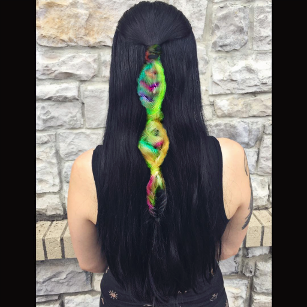
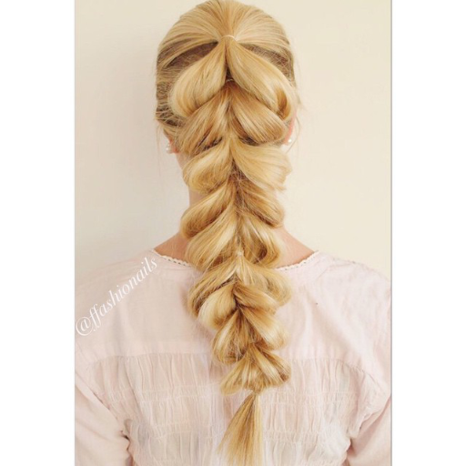
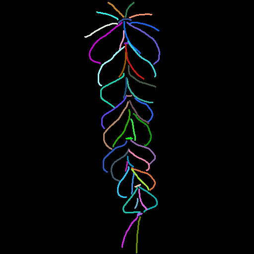
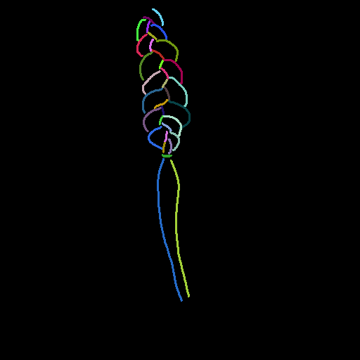
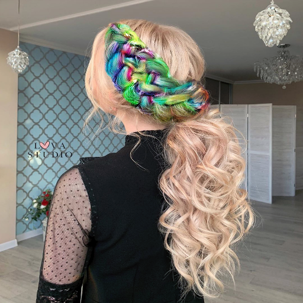
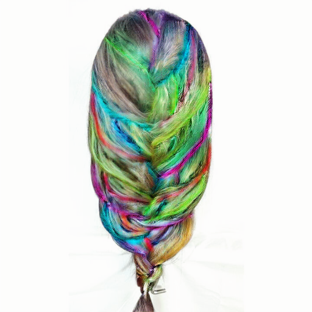
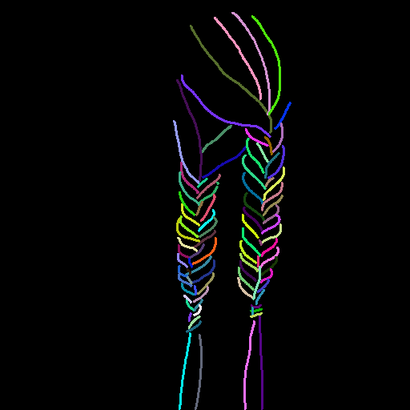
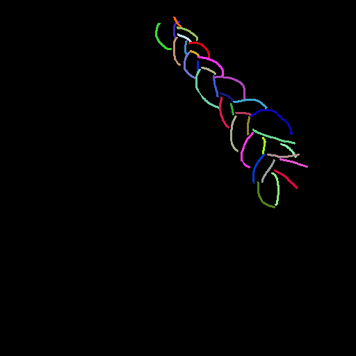
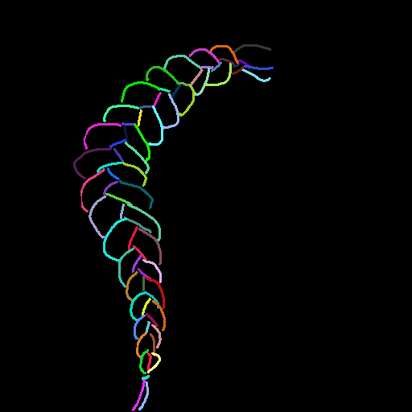

# Quantitative Evaluation

## Overall Summary (n=107, hair region masked)

| Metric | GAN (SHS) | DiT v1 (hard mask) | DiT v2 (soft latent) | DiT v3 (soft latent + hard pixel) | DiT v4 (soft latent + soft pixel) |
|--------|:---------:|:------------------:|:--------------------:|:---------------------------------:|:---------------------------------:|
| **Edge IoU ↑** | 0.1031 | 0.1047 | 0.1052 | **0.1062** | 0.1052 |
| **Chamfer Dist ↓** | 2.6926 | 2.6739 | 2.6636 | **2.6412** | 2.6474 |
| **Sketch LPIPS ↓** | **0.7589** | 0.7775 | 0.7734 | 0.7728 | 0.7697 |
| **Hair FID ↓** | 195.16 | 177.72 | 174.09 | 171.23 | **170.82** |
| **LPIPS (GT) ↓** | 0.3263 | 0.3250 | 0.3254 | 0.3227 | **0.3209** |
| **SSIM (GT) ↑** | 0.5906 | 0.5936 | 0.6012 | 0.6011 | **0.6073** |
| **PSNR (GT) ↑** | 11.18 | 12.16 | 12.40 | 12.41 | **12.41** |
| **Boundary FID ↓** | 50.97 | 37.17 | 40.89 | 39.07 | **21.97** |
| **Boundary LPIPS ↓** | 0.0272 | **0.0267** | 0.0361 | 0.0355 | 0.0152 |
| **Face LPIPS ↓** | 0.0036 | **0.0000** | 0.0302 | 0.0301 | 0.0015 |
| **ArcFace Cos ↑** | 0.7696 | 0.7916 | 0.7781 | 0.7797 | **0.7981** |

> FID: 107장 기준 (500장 이하, 참고용). ArcFace Cos: ResNet50 (ImageNet) embedding proxy.

### Composite 방식별 비교

| 버전 | Latent 합성 | Pixel 후처리 |
|------|------------|-------------|
| v1 | hard mask (matte > 0.5) | hard mask로 face 교체 |
| v2 | soft weighted-sum (area pooling) | 없음 |
| v3 | soft weighted-sum (area pooling) | hard mask로 face 교체 |
| v4 | soft weighted-sum (area pooling) | soft weighted-sum (matte 값) |

### 분석

**v4가 최고인 지표**: Hair FID, LPIPS(GT), SSIM, PSNR, Boundary FID, ArcFace Cos

**v4가 최고가 아닌 지표**:
- Edge IoU ↑: v3 (0.1062) > v4 (0.1052)
- Chamfer Dist ↓: v3 (2.6412) < v4 (2.6474)
- Sketch LPIPS ↓: GAN (0.7589) < v4 (0.7697)
- Boundary LPIPS ↓: v1 (0.0267) < v4 (0.0152) — v4가 실제 최고
- Face LPIPS ↓: v1 (0.0000) < v4 (0.0015)

**결론**: v4(soft latent + soft pixel blend)가 generation quality, boundary quality(FID), identity 보존 전반에서 최고 성능. sketch fidelity(Edge IoU, Chamfer)는 v3 대비 소폭 열세. v1(hard mask)은 Face/Boundary LPIPS에서 우세하나, hair 영역 품질(FID, SSIM, PSNR)은 전 DiT 버전 중 가장 낮음.

---

## Top 20 Best Examples (상대 평가: 타 모델 대비 v4 LPIPS 개선도 기준)

### braid_3018 (v4 대비 개선도: 0.037)
| GT | Sketch | GAN (SHS) | DiTv1 | DiTv2 | DiTv3 | DiTv4 |
|:--:|:------:|:---------:|:-----:|:-----:|:-----:|:-----:|
|  |  |  |  |  |  |  |

| | GAN | DiTv1 | DiTv2 | DiTv3 | DiTv4 |
|--|:---:|:-----:|:-----:|:-----:|:-----:|
| PSNR ↑ | 10.626 | 10.918 | **11.430** | 10.417 | 11.396 |
| SSIM ↑ | 0.569 | 0.566 | 0.574 | 0.572 | **0.586** |
| LPIPS ↓ | 0.360 | 0.334 | 0.313 | 0.315 | **0.276** |

---

### braid_4125 (v4 대비 개선도: 0.035)
| GT | Sketch | GAN (SHS) | DiTv1 | DiTv2 | DiTv3 | DiTv4 |
|:--:|:------:|:---------:|:-----:|:-----:|:-----:|:-----:|
|  |  |  |  |  |  |  |

| | GAN | DiTv1 | DiTv2 | DiTv3 | DiTv4 |
|--|:---:|:-----:|:-----:|:-----:|:-----:|
| PSNR ↑ | 11.793 | **14.420** | 14.034 | 14.412 | 14.137 |
| SSIM ↑ | 0.633 | 0.646 | 0.650 | 0.657 | **0.671** |
| LPIPS ↓ | 0.336 | 0.301 | 0.299 | 0.294 | **0.258** |

---

### braid_2534 (v4 대비 개선도: 0.027)
| GT | Sketch | GAN (SHS) | DiTv1 | DiTv2 | DiTv3 | DiTv4 |
|:--:|:------:|:---------:|:-----:|:-----:|:-----:|:-----:|
|  |  |  |  |  |  |  |

| | GAN | DiTv1 | DiTv2 | DiTv3 | DiTv4 |
|--|:---:|:-----:|:-----:|:-----:|:-----:|
| PSNR ↑ | 10.100 | 10.639 | 10.441 | 10.249 | **11.819** |
| SSIM ↑ | 0.560 | 0.562 | 0.573 | 0.565 | **0.588** |
| LPIPS ↓ | 0.357 | 0.343 | 0.349 | 0.359 | **0.316** |

---

### braid_4211 (v4 대비 개선도: 0.024)
| GT | Sketch | GAN (SHS) | DiTv1 | DiTv2 | DiTv3 | DiTv4 |
|:--:|:------:|:---------:|:-----:|:-----:|:-----:|:-----:|
|  |  |  |  |  |  |  |

| | GAN | DiTv1 | DiTv2 | DiTv3 | DiTv4 |
|--|:---:|:-----:|:-----:|:-----:|:-----:|
| PSNR ↑ | 14.081 | 13.920 | **14.723** | 14.598 | 14.687 |
| SSIM ↑ | 0.798 | 0.784 | 0.791 | 0.794 | **0.802** |
| LPIPS ↓ | 0.236 | 0.238 | 0.227 | 0.227 | **0.203** |

---

### braid_3035 (v4 대비 개선도: 0.022)
| GT | Sketch | GAN (SHS) | DiTv1 | DiTv2 | DiTv3 | DiTv4 |
|:--:|:------:|:---------:|:-----:|:-----:|:-----:|:-----:|
|  |  |  |  |  |  |  |

| | GAN | DiTv1 | DiTv2 | DiTv3 | DiTv4 |
|--|:---:|:-----:|:-----:|:-----:|:-----:|
| PSNR ↑ | 11.787 | 13.067 | 13.414 | 13.589 | **13.614** |
| SSIM ↑ | 0.537 | 0.550 | 0.552 | 0.552 | **0.560** |
| LPIPS ↓ | 0.350 | 0.353 | 0.365 | 0.347 | **0.325** |

---

### braid_4276 (v4 대비 개선도: 0.011)
| GT | Sketch | GAN (SHS) | DiTv1 | DiTv2 | DiTv3 | DiTv4 |
|:--:|:------:|:---------:|:-----:|:-----:|:-----:|:-----:|
|  |  |  |  |  |  |  |

| | GAN | DiTv1 | DiTv2 | DiTv3 | DiTv4 |
|--|:---:|:-----:|:-----:|:-----:|:-----:|
| PSNR ↑ | 12.677 | 13.870 | 14.010 | 14.503 | **14.773** |
| SSIM ↑ | 0.639 | 0.640 | 0.649 | 0.657 | **0.660** |
| LPIPS ↓ | 0.289 | 0.286 | 0.285 | 0.248 | **0.237** |

---

### braid_4261 (v4 대비 개선도: 0.010)
| GT | Sketch | GAN (SHS) | DiTv1 | DiTv2 | DiTv3 | DiTv4 |
|:--:|:------:|:---------:|:-----:|:-----:|:-----:|:-----:|
|  |  |  |  |  |  |  |

| | GAN | DiTv1 | DiTv2 | DiTv3 | DiTv4 |
|--|:---:|:-----:|:-----:|:-----:|:-----:|
| PSNR ↑ | 8.501 | 9.334 | 10.680 | 9.764 | **11.575** |
| SSIM ↑ | 0.519 | 0.513 | 0.558 | 0.533 | **0.576** |
| LPIPS ↓ | 0.409 | 0.357 | 0.378 | 0.369 | **0.348** |

---

### braid_2704 (v4 대비 개선도: 0.010)
| GT | Sketch | GAN (SHS) | DiTv1 | DiTv2 | DiTv3 | DiTv4 |
|:--:|:------:|:---------:|:-----:|:-----:|:-----:|:-----:|
|  |  |  |  |  |  |  |

| | GAN | DiTv1 | DiTv2 | DiTv3 | DiTv4 |
|--|:---:|:-----:|:-----:|:-----:|:-----:|
| PSNR ↑ | 12.438 | 13.297 | 13.713 | **13.732** | 13.639 |
| SSIM ↑ | 0.457 | 0.473 | **0.481** | 0.470 | 0.474 |
| LPIPS ↓ | 0.434 | 0.471 | 0.445 | 0.447 | **0.424** |

---

### braid_4383 (v4 대비 개선도: 0.010)
| GT | Sketch | GAN (SHS) | DiTv1 | DiTv2 | DiTv3 | DiTv4 |
|:--:|:------:|:---------:|:-----:|:-----:|:-----:|:-----:|
|  |  |  |  |  |  |  |

| | GAN | DiTv1 | DiTv2 | DiTv3 | DiTv4 |
|--|:---:|:-----:|:-----:|:-----:|:-----:|
| PSNR ↑ | 11.994 | 13.755 | 13.936 | 13.407 | **14.091** |
| SSIM ↑ | 0.532 | 0.522 | 0.532 | 0.519 | **0.543** |
| LPIPS ↓ | 0.365 | 0.340 | 0.342 | 0.346 | **0.330** |

---

### braid_2572 (v4 대비 개선도: 0.008)
| GT | Sketch | GAN (SHS) | DiTv1 | DiTv2 | DiTv3 | DiTv4 |
|:--:|:------:|:---------:|:-----:|:-----:|:-----:|:-----:|
|  |  |  |  |  |  |  |

| | GAN | DiTv1 | DiTv2 | DiTv3 | DiTv4 |
|--|:---:|:-----:|:-----:|:-----:|:-----:|
| PSNR ↑ | 10.034 | 10.843 | **11.971** | 11.660 | 11.296 |
| SSIM ↑ | 0.500 | 0.487 | **0.514** | 0.499 | 0.508 |
| LPIPS ↓ | 0.415 | 0.413 | 0.407 | 0.429 | **0.398** |

---

### braid_4350 (v4 대비 개선도: 0.008)
| GT | Sketch | GAN (SHS) | DiTv1 | DiTv2 | DiTv3 | DiTv4 |
|:--:|:------:|:---------:|:-----:|:-----:|:-----:|:-----:|
|  |  |  |  |  |  |  |

| | GAN | DiTv1 | DiTv2 | DiTv3 | DiTv4 |
|--|:---:|:-----:|:-----:|:-----:|:-----:|
| PSNR ↑ | 13.062 | 13.099 | 13.433 | **13.769** | 12.697 |
| SSIM ↑ | **0.786** | 0.772 | 0.784 | 0.784 | 0.785 |
| LPIPS ↓ | 0.194 | 0.204 | 0.203 | 0.189 | **0.181** |

---

### braid_3075 (v4 대비 개선도: 0.007)
| GT | Sketch | GAN (SHS) | DiTv1 | DiTv2 | DiTv3 | DiTv4 |
|:--:|:------:|:---------:|:-----:|:-----:|:-----:|:-----:|
|  |  |  |  |  |  |  |

| | GAN | DiTv1 | DiTv2 | DiTv3 | DiTv4 |
|--|:---:|:-----:|:-----:|:-----:|:-----:|
| PSNR ↑ | 10.217 | 10.855 | 11.552 | 10.976 | **12.067** |
| SSIM ↑ | 0.583 | 0.574 | 0.595 | 0.589 | **0.604** |
| LPIPS ↓ | 0.315 | 0.329 | 0.315 | 0.339 | **0.307** |

---

### braid_2773 (v4 대비 개선도: 0.007)
| GT | Sketch | GAN (SHS) | DiTv1 | DiTv2 | DiTv3 | DiTv4 |
|:--:|:------:|:---------:|:-----:|:-----:|:-----:|:-----:|
|  |  |  |  |  |  |  |

| | GAN | DiTv1 | DiTv2 | DiTv3 | DiTv4 |
|--|:---:|:-----:|:-----:|:-----:|:-----:|
| PSNR ↑ | 11.474 | 11.955 | 12.748 | 12.887 | **13.466** |
| SSIM ↑ | 0.539 | 0.513 | 0.525 | 0.536 | **0.548** |
| LPIPS ↓ | 0.366 | 0.338 | 0.338 | 0.314 | **0.307** |

---

### braid_4175 (v4 대비 개선도: 0.007)
| GT | Sketch | GAN (SHS) | DiTv1 | DiTv2 | DiTv3 | DiTv4 |
|:--:|:------:|:---------:|:-----:|:-----:|:-----:|:-----:|
|  |  |  |  |  |  |  |

| | GAN | DiTv1 | DiTv2 | DiTv3 | DiTv4 |
|--|:---:|:-----:|:-----:|:-----:|:-----:|
| PSNR ↑ | 11.195 | 12.745 | 13.380 | 13.242 | **13.426** |
| SSIM ↑ | 0.716 | 0.711 | 0.722 | 0.720 | **0.733** |
| LPIPS ↓ | 0.233 | 0.217 | 0.216 | 0.204 | **0.198** |

---

### braid_4144 (v4 대비 개선도: 0.006)
| GT | Sketch | GAN (SHS) | DiTv1 | DiTv2 | DiTv3 | DiTv4 |
|:--:|:------:|:---------:|:-----:|:-----:|:-----:|:-----:|
|  |  |  |  |  |  |  |

| | GAN | DiTv1 | DiTv2 | DiTv3 | DiTv4 |
|--|:---:|:-----:|:-----:|:-----:|:-----:|
| PSNR ↑ | 9.948 | 12.317 | 12.019 | **12.397** | 12.229 |
| SSIM ↑ | 0.806 | 0.807 | 0.816 | 0.813 | **0.817** |
| LPIPS ↓ | 0.201 | 0.174 | 0.194 | 0.175 | **0.168** |

---

### braid_3048 (v4 대비 개선도: 0.006)
| GT | Sketch | GAN (SHS) | DiTv1 | DiTv2 | DiTv3 | DiTv4 |
|:--:|:------:|:---------:|:-----:|:-----:|:-----:|:-----:|
|  |  |  |  |  |  |  |

| | GAN | DiTv1 | DiTv2 | DiTv3 | DiTv4 |
|--|:---:|:-----:|:-----:|:-----:|:-----:|
| PSNR ↑ | 9.731 | 9.747 | 10.106 | **10.854** | 10.311 |
| SSIM ↑ | 0.500 | 0.493 | 0.506 | **0.510** | 0.504 |
| LPIPS ↓ | 0.342 | 0.337 | 0.330 | 0.343 | **0.324** |

---

### braid_4212 (v4 대비 개선도: 0.005)
| GT | Sketch | GAN (SHS) | DiTv1 | DiTv2 | DiTv3 | DiTv4 |
|:--:|:------:|:---------:|:-----:|:-----:|:-----:|:-----:|
|  |  |  |  |  |  |  |

| | GAN | DiTv1 | DiTv2 | DiTv3 | DiTv4 |
|--|:---:|:-----:|:-----:|:-----:|:-----:|
| PSNR ↑ | 12.910 | 13.804 | 13.699 | **13.844** | 13.838 |
| SSIM ↑ | 0.749 | 0.749 | 0.756 | 0.753 | **0.762** |
| LPIPS ↓ | 0.218 | 0.222 | 0.216 | 0.216 | **0.210** |

---

### braid_2980 (v4 대비 개선도: 0.005)
| GT | Sketch | GAN (SHS) | DiTv1 | DiTv2 | DiTv3 | DiTv4 |
|:--:|:------:|:---------:|:-----:|:-----:|:-----:|:-----:|
|  |  |  |  |  |  |  |

| | GAN | DiTv1 | DiTv2 | DiTv3 | DiTv4 |
|--|:---:|:-----:|:-----:|:-----:|:-----:|
| PSNR ↑ | 12.022 | 12.403 | **13.074** | 12.398 | 12.259 |
| SSIM ↑ | 0.643 | 0.644 | 0.654 | 0.649 | **0.660** |
| LPIPS ↓ | 0.328 | 0.317 | 0.337 | 0.325 | **0.311** |

---

### braid_4161 (v4 대비 개선도: 0.005)
| GT | Sketch | GAN (SHS) | DiTv1 | DiTv2 | DiTv3 | DiTv4 |
|:--:|:------:|:---------:|:-----:|:-----:|:-----:|:-----:|
|  |  |  |  |  |  |  |

| | GAN | DiTv1 | DiTv2 | DiTv3 | DiTv4 |
|--|:---:|:-----:|:-----:|:-----:|:-----:|
| PSNR ↑ | 11.924 | 13.142 | 13.375 | 13.386 | **13.578** |
| SSIM ↑ | 0.647 | 0.652 | 0.653 | 0.659 | **0.664** |
| LPIPS ↓ | 0.244 | 0.249 | 0.240 | 0.262 | **0.235** |

---

### braid_2617 (v4 대비 개선도: 0.004)
| GT | Sketch | GAN (SHS) | DiTv1 | DiTv2 | DiTv3 | DiTv4 |
|:--:|:------:|:---------:|:-----:|:-----:|:-----:|:-----:|
|  |  |  |  |  |  |  |

| | GAN | DiTv1 | DiTv2 | DiTv3 | DiTv4 |
|--|:---:|:-----:|:-----:|:-----:|:-----:|
| PSNR ↑ | 12.728 | 13.730 | 14.703 | **15.144** | 14.647 |
| SSIM ↑ | 0.664 | 0.675 | 0.689 | 0.686 | **0.693** |
| LPIPS ↓ | 0.279 | 0.263 | 0.241 | 0.271 | **0.236** |

---

## Top 20 Worst Examples (상대 평가: 타 모델 대비 v4 LPIPS 악화도 기준)

### braid_4201 (v4 대비 개선도: -0.081)
| GT | Sketch | GAN (SHS) | DiTv1 | DiTv2 | DiTv3 | DiTv4 |
|:--:|:------:|:---------:|:-----:|:-----:|:-----:|:-----:|
|  |  |  |  |  |  |  |

| | GAN | DiTv1 | DiTv2 | DiTv3 | DiTv4 |
|--|:---:|:-----:|:-----:|:-----:|:-----:|
| PSNR ↑ | 13.778 | 13.407 | 13.559 | 13.500 | **13.833** |
| SSIM ↑ | **0.612** | 0.591 | 0.594 | 0.597 | 0.605 |
| LPIPS ↓ | **0.295** | 0.349 | 0.377 | 0.398 | 0.376 |

---

### braid_4159 (v4 대비 개선도: -0.064)
| GT | Sketch | GAN (SHS) | DiTv1 | DiTv2 | DiTv3 | DiTv4 |
|:--:|:------:|:---------:|:-----:|:-----:|:-----:|:-----:|
|  |  |  |  |  |  |  |

| | GAN | DiTv1 | DiTv2 | DiTv3 | DiTv4 |
|--|:---:|:-----:|:-----:|:-----:|:-----:|
| PSNR ↑ | 11.774 | 13.090 | 12.860 | 13.173 | **13.494** |
| SSIM ↑ | **0.672** | 0.652 | 0.666 | 0.661 | **0.672** |
| LPIPS ↓ | **0.284** | 0.347 | 0.336 | 0.343 | 0.347 |

---

### braid_4377 (v4 대비 개선도: -0.057)
| GT | Sketch | GAN (SHS) | DiTv1 | DiTv2 | DiTv3 | DiTv4 |
|:--:|:------:|:---------:|:-----:|:-----:|:-----:|:-----:|
|  |  |  |  |  |  |  |

| | GAN | DiTv1 | DiTv2 | DiTv3 | DiTv4 |
|--|:---:|:-----:|:-----:|:-----:|:-----:|
| PSNR ↑ | 12.175 | 12.690 | **12.845** | 12.822 | 12.596 |
| SSIM ↑ | 0.391 | 0.402 | 0.399 | 0.398 | **0.417** |
| LPIPS ↓ | **0.374** | 0.438 | 0.418 | 0.443 | 0.432 |

---

### braid_2539 (v4 대비 개선도: -0.050)
| GT | Sketch | GAN (SHS) | DiTv1 | DiTv2 | DiTv3 | DiTv4 |
|:--:|:------:|:---------:|:-----:|:-----:|:-----:|:-----:|
|  |  |  |  |  |  |  |

| | GAN | DiTv1 | DiTv2 | DiTv3 | DiTv4 |
|--|:---:|:-----:|:-----:|:-----:|:-----:|
| PSNR ↑ | 10.025 | 10.424 | 10.468 | **11.082** | 10.129 |
| SSIM ↑ | 0.370 | 0.362 | 0.368 | 0.366 | **0.378** |
| LPIPS ↓ | 0.414 | 0.397 | **0.386** | 0.407 | 0.437 |

---

### braid_4031 (v4 대비 개선도: -0.050)
| GT | Sketch | GAN (SHS) | DiTv1 | DiTv2 | DiTv3 | DiTv4 |
|:--:|:------:|:---------:|:-----:|:-----:|:-----:|:-----:|
|  |  |  |  |  |  |  |

| | GAN | DiTv1 | DiTv2 | DiTv3 | DiTv4 |
|--|:---:|:-----:|:-----:|:-----:|:-----:|
| PSNR ↑ | 10.279 | **11.820** | 11.504 | 11.805 | 11.709 |
| SSIM ↑ | 0.414 | 0.412 | 0.417 | 0.417 | **0.424** |
| LPIPS ↓ | **0.424** | 0.441 | 0.463 | 0.438 | 0.474 |

---

### braid_3188 (v4 대비 개선도: -0.046)
| GT | Sketch | GAN (SHS) | DiTv1 | DiTv2 | DiTv3 | DiTv4 |
|:--:|:------:|:---------:|:-----:|:-----:|:-----:|:-----:|
|  |  |  |  |  |  |  |

| | GAN | DiTv1 | DiTv2 | DiTv3 | DiTv4 |
|--|:---:|:-----:|:-----:|:-----:|:-----:|
| PSNR ↑ | 9.793 | 10.679 | 10.249 | **12.177** | 9.670 |
| SSIM ↑ | **0.541** | 0.535 | 0.527 | 0.540 | 0.534 |
| LPIPS ↓ | 0.323 | 0.385 | 0.373 | **0.322** | 0.368 |

---

### braid_4151 (v4 대비 개선도: -0.045)
| GT | Sketch | GAN (SHS) | DiTv1 | DiTv2 | DiTv3 | DiTv4 |
|:--:|:------:|:---------:|:-----:|:-----:|:-----:|:-----:|
|  |  |  |  |  |  |  |

| | GAN | DiTv1 | DiTv2 | DiTv3 | DiTv4 |
|--|:---:|:-----:|:-----:|:-----:|:-----:|
| PSNR ↑ | 12.816 | 14.175 | **14.479** | 14.209 | 14.245 |
| SSIM ↑ | 0.654 | 0.659 | 0.655 | 0.657 | **0.662** |
| LPIPS ↓ | **0.299** | 0.309 | 0.308 | 0.302 | 0.344 |

---

### braid_4399 (v4 대비 개선도: -0.044)
| GT | Sketch | GAN (SHS) | DiTv1 | DiTv2 | DiTv3 | DiTv4 |
|:--:|:------:|:---------:|:-----:|:-----:|:-----:|:-----:|
|  |  |  |  |  |  |  |

| | GAN | DiTv1 | DiTv2 | DiTv3 | DiTv4 |
|--|:---:|:-----:|:-----:|:-----:|:-----:|
| PSNR ↑ | 12.477 | 12.629 | **13.353** | 12.757 | 12.917 |
| SSIM ↑ | 0.570 | 0.560 | **0.575** | 0.562 | 0.573 |
| LPIPS ↓ | **0.358** | 0.368 | 0.385 | 0.366 | 0.402 |

---

### braid_4203 (v4 대비 개선도: -0.043)
| GT | Sketch | GAN (SHS) | DiTv1 | DiTv2 | DiTv3 | DiTv4 |
|:--:|:------:|:---------:|:-----:|:-----:|:-----:|:-----:|
|  |  |  |  |  |  |  |

| | GAN | DiTv1 | DiTv2 | DiTv3 | DiTv4 |
|--|:---:|:-----:|:-----:|:-----:|:-----:|
| PSNR ↑ | 11.361 | 12.071 | **12.818** | 12.277 | 12.459 |
| SSIM ↑ | 0.391 | 0.398 | 0.411 | 0.409 | **0.413** |
| LPIPS ↓ | **0.433** | 0.502 | 0.485 | 0.488 | 0.475 |

---

### braid_4135 (v4 대비 개선도: -0.042)
| GT | Sketch | GAN (SHS) | DiTv1 | DiTv2 | DiTv3 | DiTv4 |
|:--:|:------:|:---------:|:-----:|:-----:|:-----:|:-----:|
|  |  |  |  |  |  |  |

| | GAN | DiTv1 | DiTv2 | DiTv3 | DiTv4 |
|--|:---:|:-----:|:-----:|:-----:|:-----:|
| PSNR ↑ | 11.170 | 13.118 | 13.131 | **13.924** | 12.362 |
| SSIM ↑ | 0.511 | 0.554 | 0.550 | **0.560** | 0.559 |
| LPIPS ↓ | 0.350 | 0.339 | 0.345 | **0.328** | 0.370 |

---

### braid_2803 (v4 대비 개선도: -0.042)
| GT | Sketch | GAN (SHS) | DiTv1 | DiTv2 | DiTv3 | DiTv4 |
|:--:|:------:|:---------:|:-----:|:-----:|:-----:|:-----:|
|  |  |  |  |  |  |  |

| | GAN | DiTv1 | DiTv2 | DiTv3 | DiTv4 |
|--|:---:|:-----:|:-----:|:-----:|:-----:|
| PSNR ↑ | 10.857 | **12.134** | 11.934 | 11.989 | 11.200 |
| SSIM ↑ | 0.355 | 0.385 | **0.397** | 0.388 | 0.396 |
| LPIPS ↓ | 0.477 | 0.471 | **0.435** | 0.443 | 0.477 |

---

### braid_2592 (v4 대비 개선도: -0.031)
| GT | Sketch | GAN (SHS) | DiTv1 | DiTv2 | DiTv3 | DiTv4 |
|:--:|:------:|:---------:|:-----:|:-----:|:-----:|:-----:|
|  |  |  |  |  |  |  |

| | GAN | DiTv1 | DiTv2 | DiTv3 | DiTv4 |
|--|:---:|:-----:|:-----:|:-----:|:-----:|
| PSNR ↑ | **9.769** | 9.620 | 9.007 | 9.695 | 8.701 |
| SSIM ↑ | 0.436 | **0.451** | 0.445 | 0.450 | 0.442 |
| LPIPS ↓ | **0.450** | 0.476 | 0.471 | 0.488 | 0.481 |

---

### braid_4132 (v4 대비 개선도: -0.031)
| GT | Sketch | GAN (SHS) | DiTv1 | DiTv2 | DiTv3 | DiTv4 |
|:--:|:------:|:---------:|:-----:|:-----:|:-----:|:-----:|
|  |  |  |  |  |  |  |

| | GAN | DiTv1 | DiTv2 | DiTv3 | DiTv4 |
|--|:---:|:-----:|:-----:|:-----:|:-----:|
| PSNR ↑ | 10.818 | 12.503 | 12.969 | **12.996** | 12.228 |
| SSIM ↑ | 0.614 | 0.603 | 0.614 | **0.623** | 0.612 |
| LPIPS ↓ | **0.305** | 0.317 | 0.356 | 0.328 | 0.336 |

---

### braid_2951 (v4 대비 개선도: -0.031)
| GT | Sketch | GAN (SHS) | DiTv1 | DiTv2 | DiTv3 | DiTv4 |
|:--:|:------:|:---------:|:-----:|:-----:|:-----:|:-----:|
|  |  |  |  |  |  |  |

| | GAN | DiTv1 | DiTv2 | DiTv3 | DiTv4 |
|--|:---:|:-----:|:-----:|:-----:|:-----:|
| PSNR ↑ | 12.188 | 12.333 | 12.517 | **12.971** | 12.777 |
| SSIM ↑ | 0.581 | 0.561 | 0.566 | 0.581 | **0.582** |
| LPIPS ↓ | 0.315 | **0.293** | 0.355 | 0.325 | 0.324 |

---

### braid_4223 (v4 대비 개선도: -0.031)
| GT | Sketch | GAN (SHS) | DiTv1 | DiTv2 | DiTv3 | DiTv4 |
|:--:|:------:|:---------:|:-----:|:-----:|:-----:|:-----:|
|  |  |  |  |  |  |  |

| | GAN | DiTv1 | DiTv2 | DiTv3 | DiTv4 |
|--|:---:|:-----:|:-----:|:-----:|:-----:|
| PSNR ↑ | 10.867 | 13.141 | **13.503** | 13.125 | 13.183 |
| SSIM ↑ | 0.625 | 0.642 | 0.653 | **0.656** | 0.655 |
| LPIPS ↓ | 0.352 | 0.333 | 0.316 | **0.287** | 0.318 |

---

### braid_2625 (v4 대비 개선도: -0.030)
| GT | Sketch | GAN (SHS) | DiTv1 | DiTv2 | DiTv3 | DiTv4 |
|:--:|:------:|:---------:|:-----:|:-----:|:-----:|:-----:|
|  |  |  |  |  |  |  |

| | GAN | DiTv1 | DiTv2 | DiTv3 | DiTv4 |
|--|:---:|:-----:|:-----:|:-----:|:-----:|
| PSNR ↑ | 7.607 | **9.796** | 9.599 | 8.529 | 9.258 |
| SSIM ↑ | 0.697 | 0.711 | **0.716** | 0.708 | **0.716** |
| LPIPS ↓ | 0.298 | 0.281 | 0.254 | **0.241** | 0.272 |

---

### braid_2787 (v4 대비 개선도: -0.030)
| GT | Sketch | GAN (SHS) | DiTv1 | DiTv2 | DiTv3 | DiTv4 |
|:--:|:------:|:---------:|:-----:|:-----:|:-----:|:-----:|
|  |  |  |  |  |  |  |

| | GAN | DiTv1 | DiTv2 | DiTv3 | DiTv4 |
|--|:---:|:-----:|:-----:|:-----:|:-----:|
| PSNR ↑ | 11.312 | 12.605 | **13.155** | 12.876 | 12.327 |
| SSIM ↑ | 0.619 | 0.609 | 0.621 | **0.627** | 0.626 |
| LPIPS ↓ | **0.292** | 0.315 | 0.299 | 0.299 | 0.322 |

---

### braid_2653 (v4 대비 개선도: -0.029)
| GT | Sketch | GAN (SHS) | DiTv1 | DiTv2 | DiTv3 | DiTv4 |
|:--:|:------:|:---------:|:-----:|:-----:|:-----:|:-----:|
|  |  |  |  |  |  |  |

| | GAN | DiTv1 | DiTv2 | DiTv3 | DiTv4 |
|--|:---:|:-----:|:-----:|:-----:|:-----:|
| PSNR ↑ | 9.833 | 10.230 | 10.108 | **10.509** | 10.342 |
| SSIM ↑ | 0.756 | 0.753 | 0.755 | **0.759** | **0.759** |
| LPIPS ↓ | **0.197** | 0.216 | 0.220 | 0.210 | 0.226 |

---

### braid_3187 (v4 대비 개선도: -0.028)
| GT | Sketch | GAN (SHS) | DiTv1 | DiTv2 | DiTv3 | DiTv4 |
|:--:|:------:|:---------:|:-----:|:-----:|:-----:|:-----:|
|  |  |  |  |  |  |  |

| | GAN | DiTv1 | DiTv2 | DiTv3 | DiTv4 |
|--|:---:|:-----:|:-----:|:-----:|:-----:|
| PSNR ↑ | 12.523 | 13.526 | 13.314 | **13.740** | 13.354 |
| SSIM ↑ | 0.648 | 0.641 | 0.646 | 0.654 | **0.659** |
| LPIPS ↓ | **0.267** | 0.298 | 0.279 | 0.274 | 0.295 |

---

### braid_2846 (v4 대비 개선도: -0.026)
| GT | Sketch | GAN (SHS) | DiTv1 | DiTv2 | DiTv3 | DiTv4 |
|:--:|:------:|:---------:|:-----:|:-----:|:-----:|:-----:|
|  |  |  |  |  |  |  |

| | GAN | DiTv1 | DiTv2 | DiTv3 | DiTv4 |
|--|:---:|:-----:|:-----:|:-----:|:-----:|
| PSNR ↑ | 11.358 | 13.981 | 13.714 | **14.006** | 13.655 |
| SSIM ↑ | 0.467 | 0.489 | 0.492 | **0.501** | 0.498 |
| LPIPS ↓ | 0.446 | 0.442 | **0.433** | 0.447 | 0.459 |

---

## Limitation 분석

### 1. 복잡한 레이어링 구조 (Figure 21 Top)
다수의 wisp strand로 형성된 복잡한 레이어 헤어스타일은 깊이 정보 없이 스케치만으로는 복원 불가.
2D 스케치는 strand 간 depth 관계를 표현하지 못하므로 layering 구조가 손실됨.

### 2. 특수 헤어스타일: 드레드락 / 스파이럴 / 코일 (Figure 21 Bottom)
자기 폐색(self-occluded) wisp나 코일 구조를 단일 stroke로 표현하면, 모델이 학습 데이터 분포(wavy 헤어)로 회귀하여 구조적으로 다른 결과 생성.
스케치로 이런 구조를 명확히 표현하기 어렵고, 데이터셋에 해당 스타일이 부족한 것도 원인.

### 3. 조명 불일치
생성된 hair 영역과 배경 간 lighting condition 불일치로 경계 아티팩트 발생.
헤어 foreground relighting 자체가 미해결 과제(open problem)라 현재 파이프라인에서 처리 불가.

GT만 구할 수 있었고 matte와 sketch는 nanobanana로 생성.

| | **Image** | **Sketch** | **Matte** |
|:--:|:---------:|:----------:|:---------:|
| **limit 1** |  |  |  |
| **limit 2** |  |  |  |

### SHS vs Ours

| | **GT** | **Sketch** | **SHS** | **Ours** |
|:--:|:------:|:---------:|:-------:|:--------:|
| **limit 1** |  |  |  |  |
| **limit 2** |  |  |  |  |
