## Limitation 분석

### 1. 복잡한 레이어링 구조 (Figure 21 Top)
다수의 wisp strand로 형성된 복잡한 레이어 헤어스타일은 깊이 정보 없이 스케치만으로는 복원 불가.
2D 스케치는 strand 간 depth 관계를 표현하지 못하므로 layering 구조가 손실됨.

### 2. 특수 헤어스타일: 드레드락 / 스파이럴 / 코일 (Figure 21 Bottom)
자기 폐색(self-occluded) wisp나 코일 구조를 단일 stroke로 표현하면, 모델이 학습 데이터 분포(wavy 헤어)로 회귀하여 구조적으로 다른 결과 생성.
스케치로 이런 구조를 명확히 표현하기 어렵고, 데이터셋에 해당 스타일이 부족한 것도 원인.

### 3. 조명 불일치
생성된 hair 영역과 배경 간 lighting condition 불일치로 경계 아티팩트 발생.
헤어 foreground relighting 자체가 미해결 과제(open problem)라 현재 파이프라인에서 처리 불가.

GT만 구할 수 있었고 matte와 sketch는 nanobanana로 생성.

| | **Image** | **Sketch** | **Matte** |
|:--:|:---------:|:----------:|:---------:|
| **limit 1** |  |  |  |
| **limit 2** |  |  |  |

### SHS vs Ours

| | **GT** | **Sketch** | **SHS** | **Ours** |
|:--:|:------:|:---------:|:-------:|:--------:|
| **limit 1** |  | 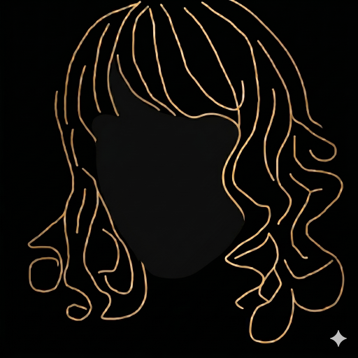 | 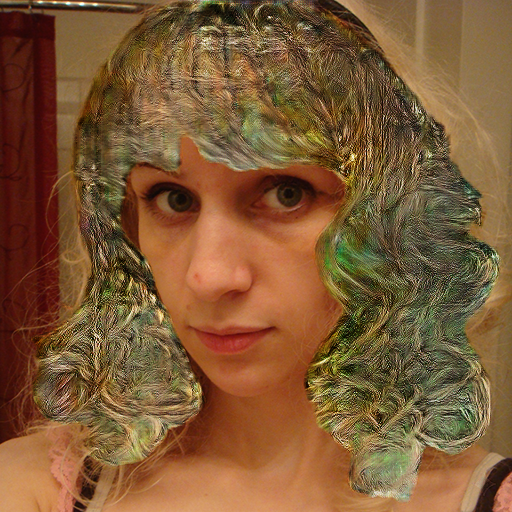 | 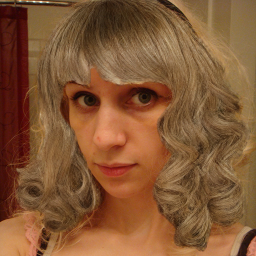 |
| **limit 2** |  | 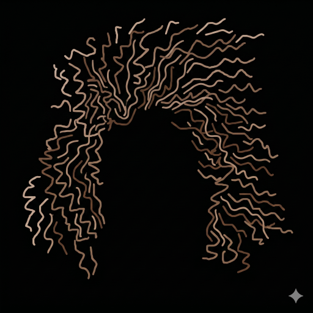 | 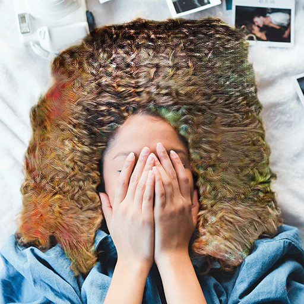 |  |

### SHS vs Ours (watermark 제거)

| | **GT** | **Sketch** | **SHS** | **Ours** |
|:--:|:------:|:---------:|:-------:|:--------:|
| **limit 1** |  | 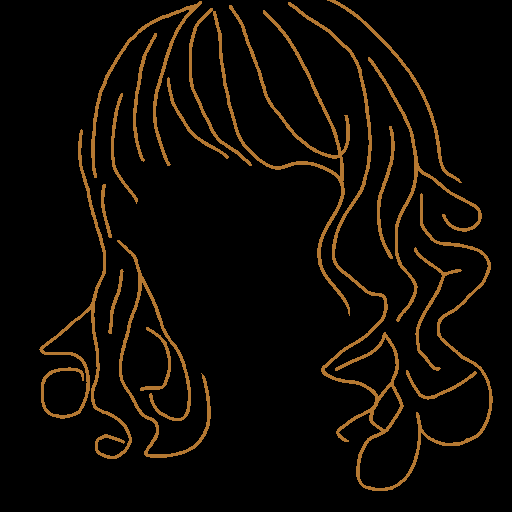 | 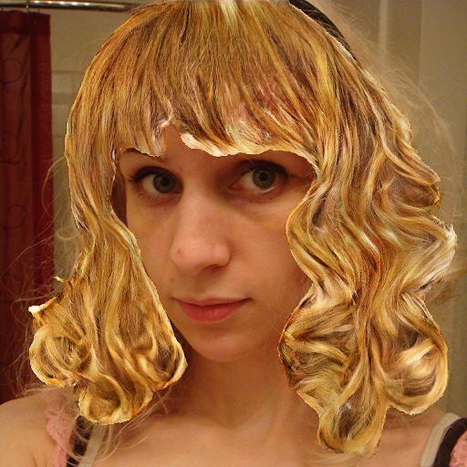 |  |
| **limit 2** |  | 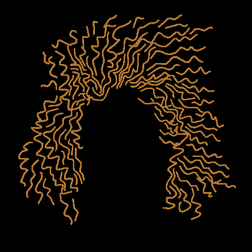 | 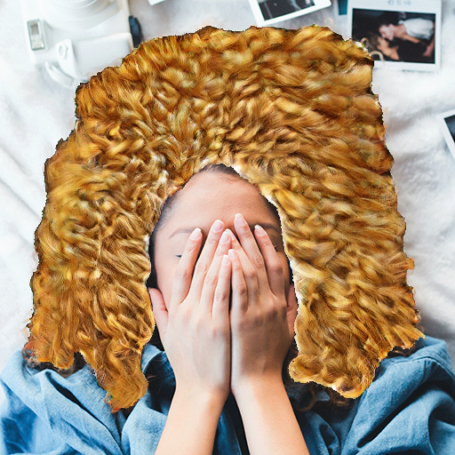 |  |

### 논문과 동일한 stroke(최대한)

| | **GT** | **Sketch** | **SHS** | **Ours** |
|:--:|:------:|:---------:|:-------:|:--------:|
| **limit 1** |  | 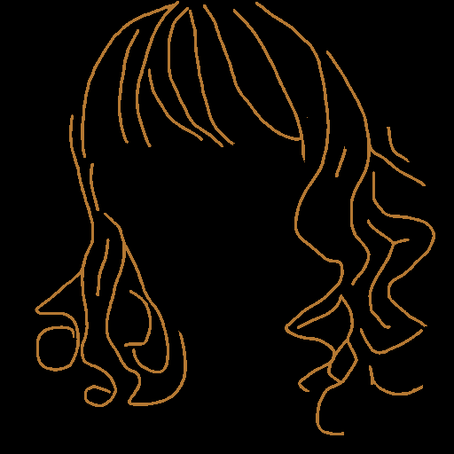 | 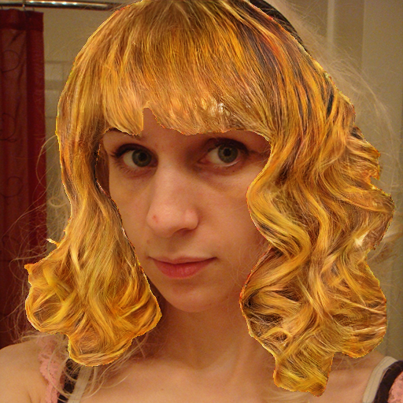 |  |
| **limit 2** |  | 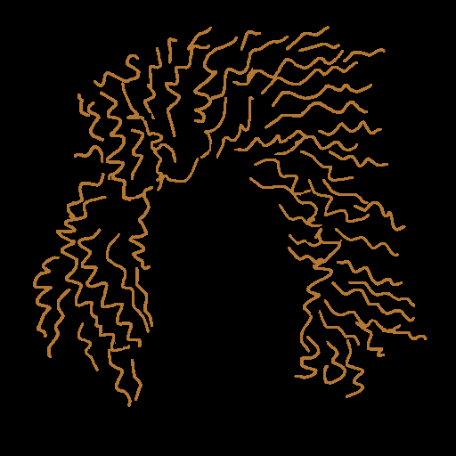 | 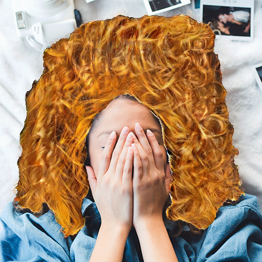 |  |

> ours 아직 업데이트 안됨. 