# Inversion Adapter 추론 결과

> **모델**: `checkpoints/inversion/best.pth` (epoch 25, val_loss 0.6838)
>
> **추론 결과 경로**: `inversion/img2sketch/`
> - sketch_pred: `{stem}_sketch.png`
> - matte_pred:  `{stem}_matte.png`

---

## 표 1.hair2sketch/hair2matte 결과 (16 샘플)

| # | Hair GT | sketch_pred | sketch_GT | matte_pred | matte_GT |
|---|---------|-------------|-----------|------------|----------|
| 1 |  | 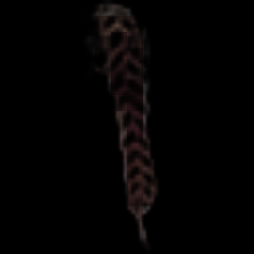 |  | 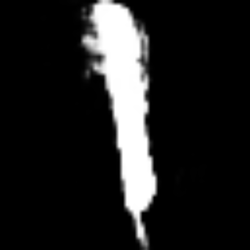 |  |
| 2 |  | 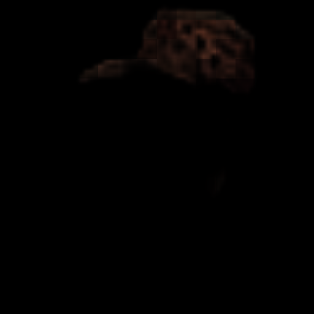 |  | 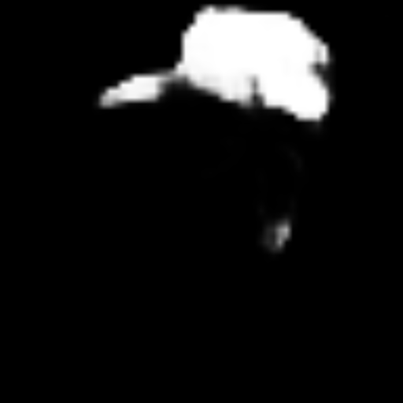 |  |
| 3 |  |  |  | 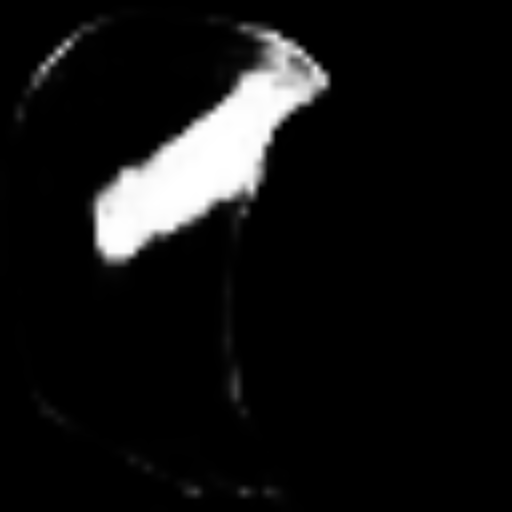 |  |
| 4 |  | 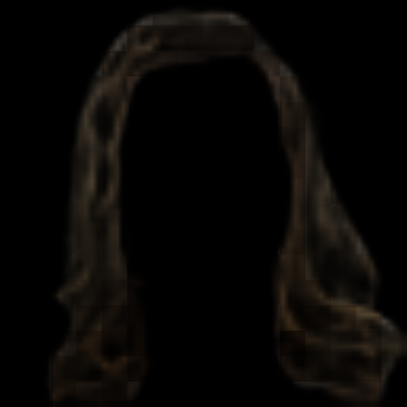 |  |  |  |
| 5 |  | 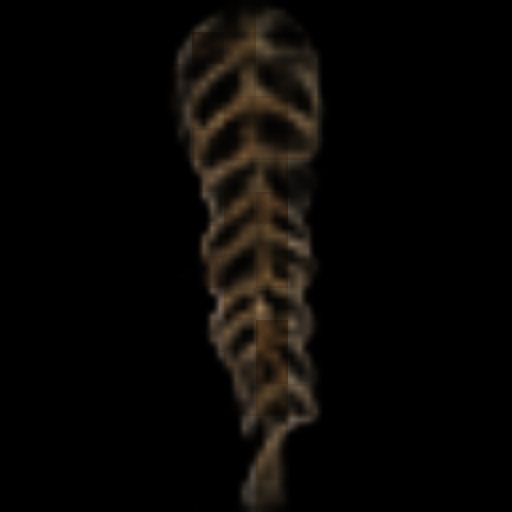 |  | 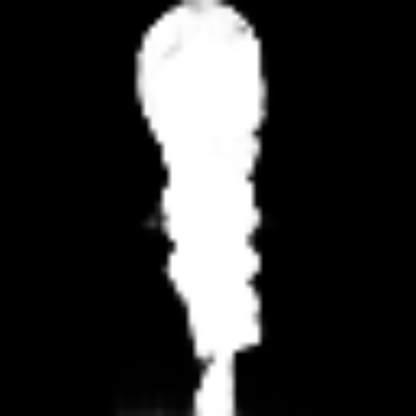 |  |
| 6 |  | 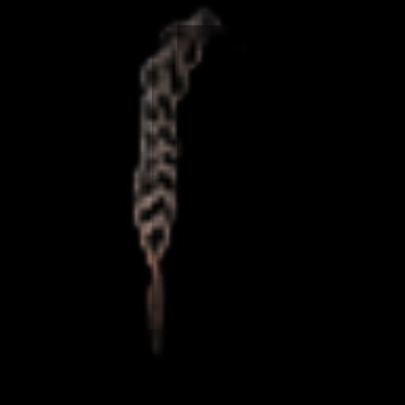 |  | 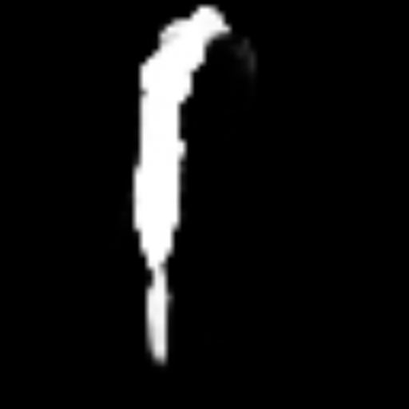 |  |
| 7 |  | 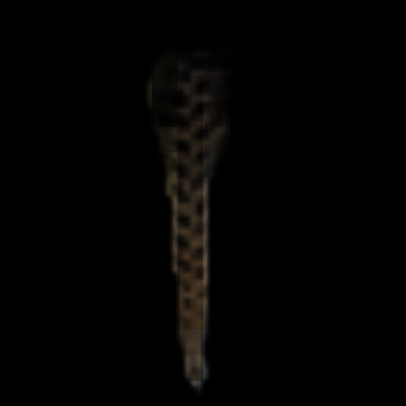 |  | 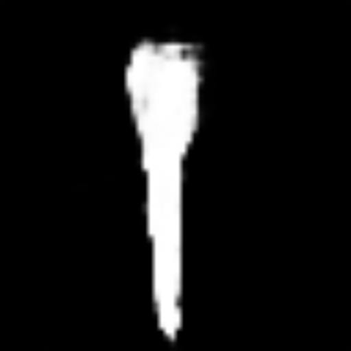 |  |
| 8 |  | 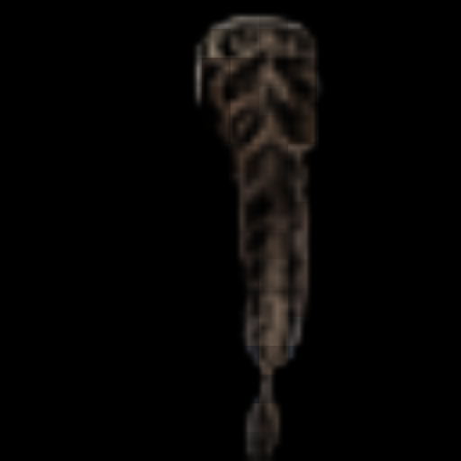 |  |  |  |
| 9 |  | 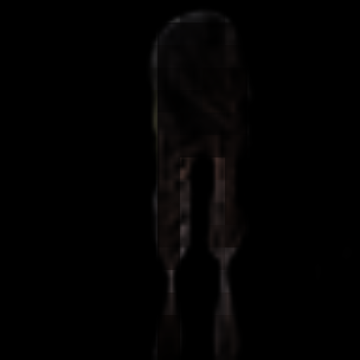 |  | 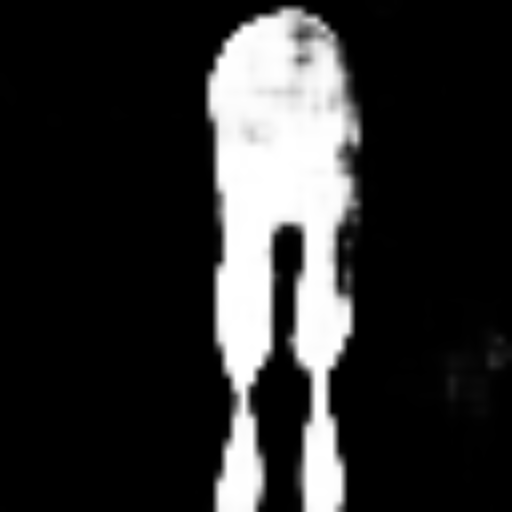 |  |
| 10 |  | 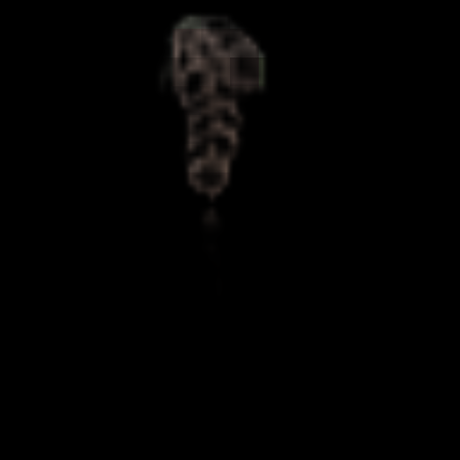 |  | 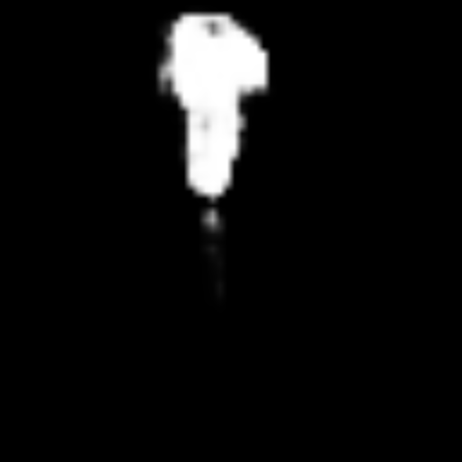 |  |
| 11 |  |  |  | 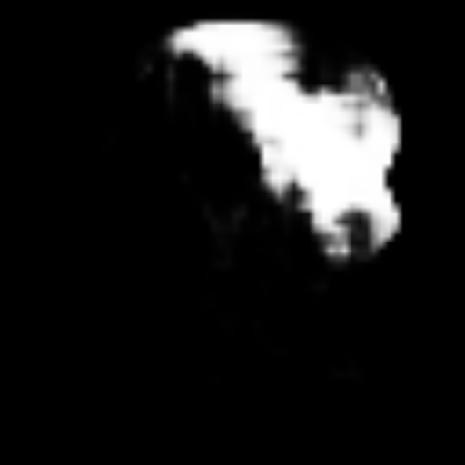 |  |
| 12 |  | 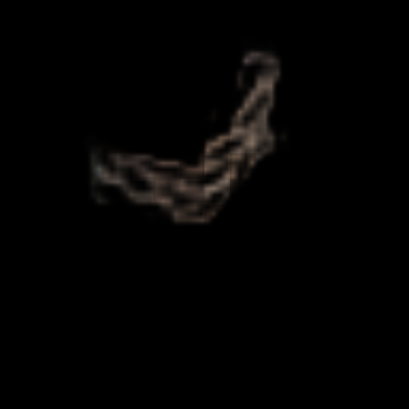 |  | 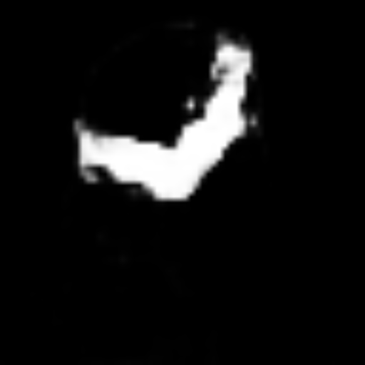 |  |
| 13 |  | 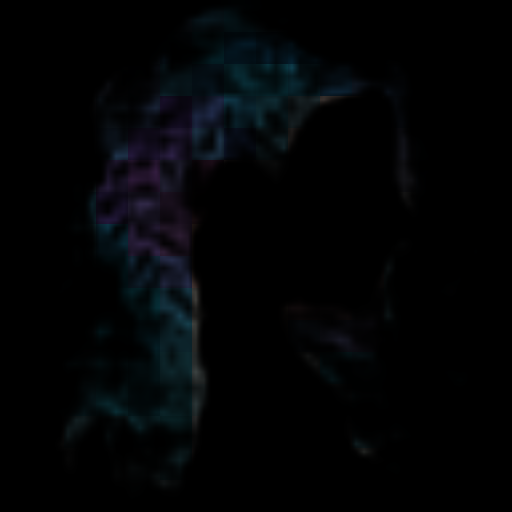 |  | 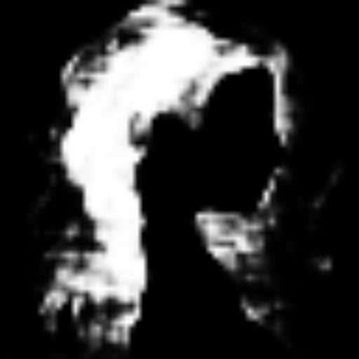 |  |
| 14 |  | 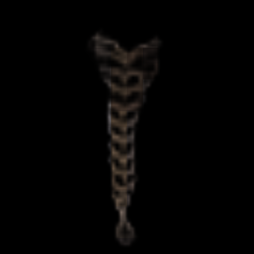 |  |  |  |
| 15 |  | 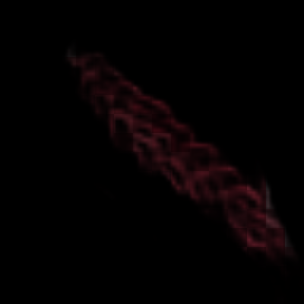 |  | 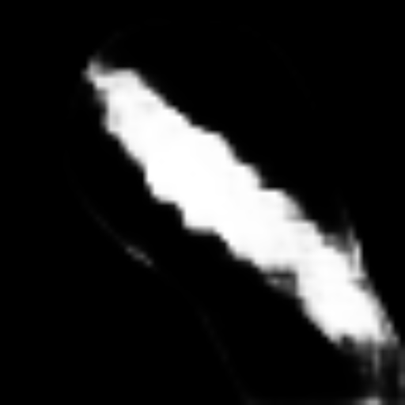 |  |


---

## 표 2. hair2img, hair2sketch 추론 결과

**파이프라인**:
```
Hair GT
  → [HairInversionAdapter]
  → sketch_pred + matte_pred          (inversion/img2sketch/)
  → [HairControlNet + SD3.5]
  → round-trip 재생성 (full image)    (inversion/roundtrips/)
```
- `sketch_pred` / `matte_pred`를 그대로 forward model(HairControlNet)에 넣어 hair를 재생성
- face latent와 latent space에서 합성 후 pixel space soft blend
- GT와 round-trip 결과가 유사할수록 inversion quality가 높음

| # | sketch_pred | matte_pred | round-trip | Hair GT |
|---|-------------|------------|------------|---------|
| 1 |  |  | 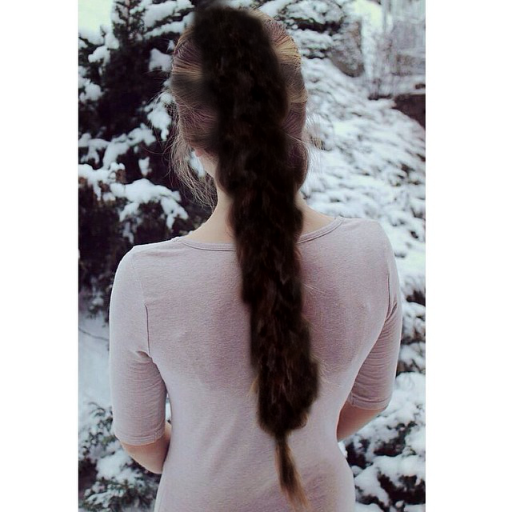 |  |
| 2 |  |  | 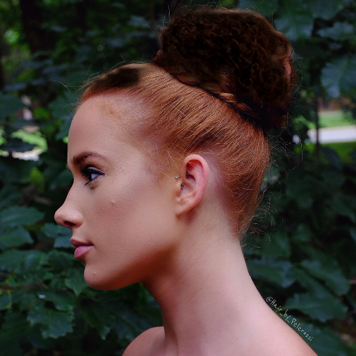 |  |
| 3 |  |  | 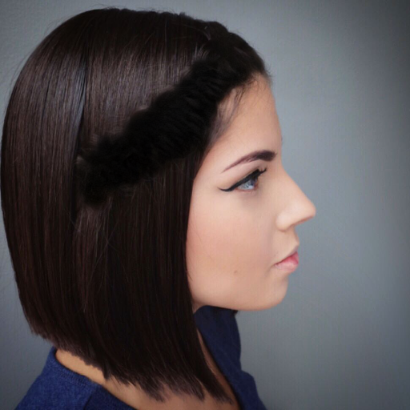 |  |
| 4 |  |  |  |  |
| 5 |  |  | 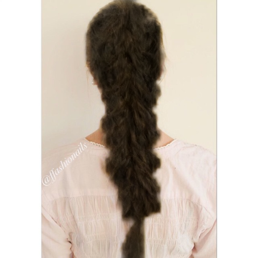 |  |
| 6 |  |  | 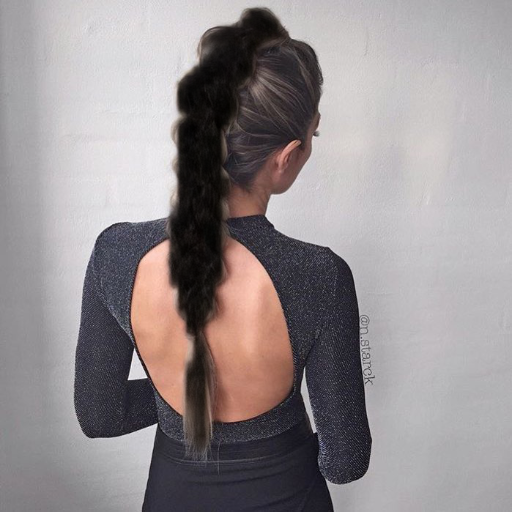 |  |
| 7 |  |  | 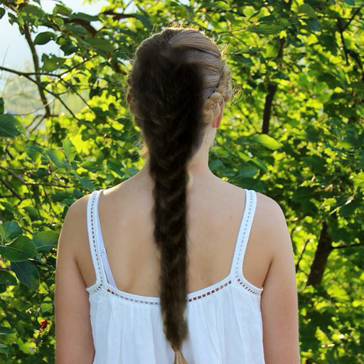 |  |
| 8 |  |  | 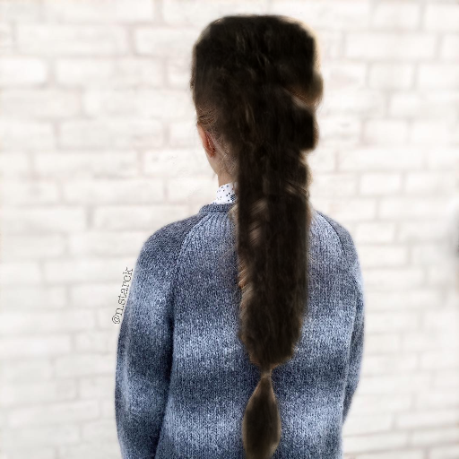 |  |
| 9 |  |  | 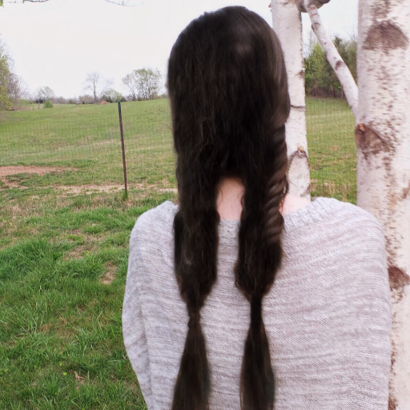 |  |
| 10 |  |  | 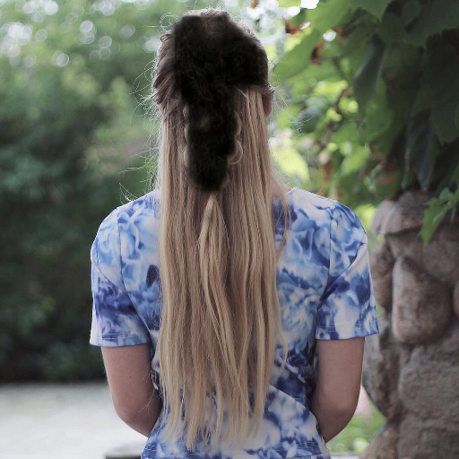 |  |
| 11 |  |  |  |  |
| 12 |  |  | 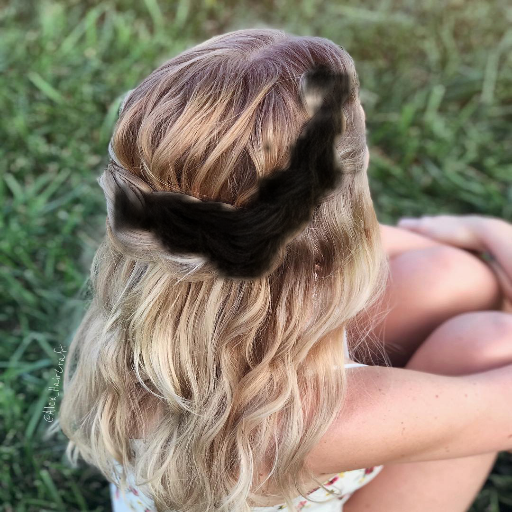 |  |
| 13 |  |  |  |  |
| 14 |  |  | 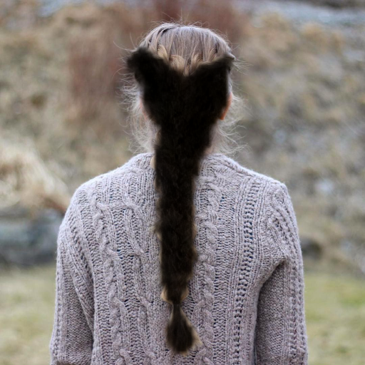 |  |
| 15 |  |  | 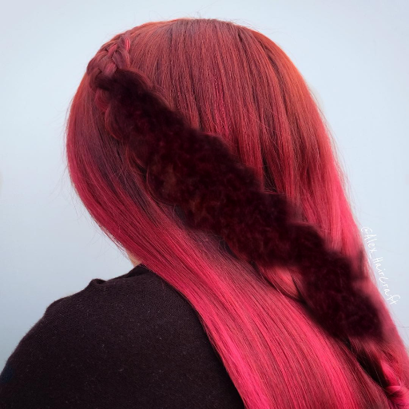 |  |

