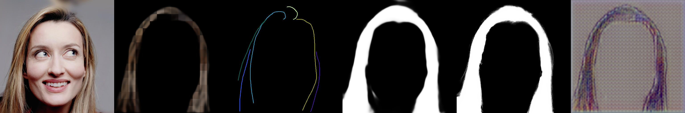
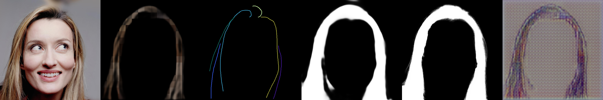
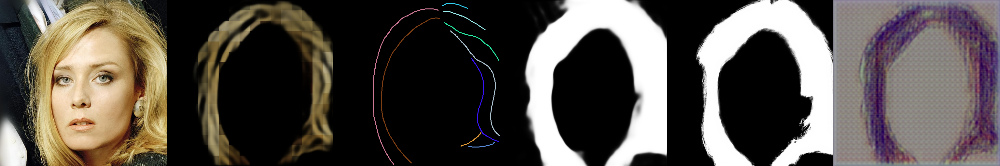
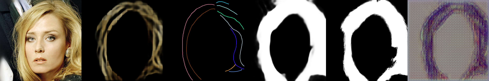
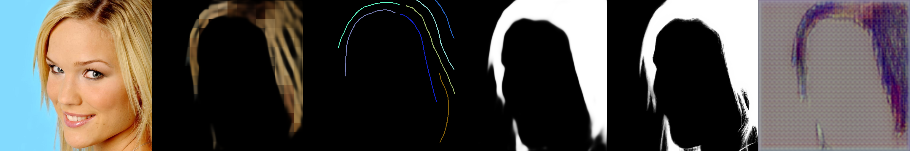
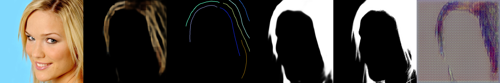
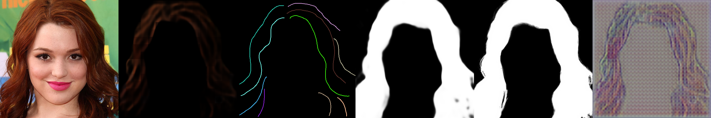
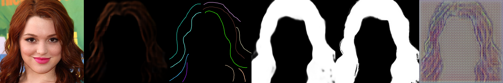

# Tensorboard 학습 로그 분석

- Tensorboard에 기록된 step 8000, step 10000의 시각적 변화를 정리.
- step 별 시각화결과를 추적후 기록 예정.

## Tensorboard 1열 ~ 6열의 의미

| 열(Column) | 이름 (변수명) | 설명 |
| :--- | :--- | :--- |
| **1열** | 원본 헤어 (`hair_image`) | GT |
| **2열** | 예측 스케치 (`sketch_pred`) | 예측 스케치 |
| **3열** | 정답 스케치 (`sketch_gt`) | 정답 스케치 |
| **4열** | 예측 마스크 (`matte_pred`) | 예측 matte |
| **5열** | 정답 마스크 (`matte_gt`) | 정답 matte |
| **6열** | 복원 헤어 (`hair_recon`) | 예측 스케치와 예측 matte를 ControlNet에 넣어서 생성한 머리카락 이미지 (Cycle Loss용돈) |

## step 8000(위) 과 step 10000(아래) 의 비교

> 아래 시각화 결과는 모두 학습에 사용되지 않은 **Validation Dataset**을 대상으로 추론 및 시각화한 이미지

________________________________________________________

________________________________________________________

________________________________________________________

________________________________________________________

학습이 진행됨에 따라 얘측된 sketch의 detail이 살아나는 것을 확인 할 수 있다. 

## Loss 전체 정리

학습은 GT를 따라 그리는 Supervised Loss와, 복원 퀄리티를 높이는 Cycle Loss 두 축으로 이루어진다.

### 1. Supervised Loss
모델이 매 스텝마다 정답 스케치와 마스크를 얼마나 똑같이 예측했는지 채점한다.

- **Structure Loss**
  - **비교 대상**: 예측 스케치 윤곽선 vs 정답 스케치 윤곽선 (BCE Loss)
  - **목적**: 스케치 선의 형태, 위치, 굵기를 GT와 유사하도록 유도한다.
- **Color Loss**
  - **비교 대상**: 예측 스케치 색상 vs 정답 스케치 색상 (L1 Loss)
  - **목적**: 선이 있는 부분에 빛 반사, 음영 등 머리카락 텍스처 색상을 GT와 일치시킨다. (선이 있는 부분에서만 채점)
- **Matte Loss**
  - **비교 대상**: 예측 마스크(4열) vs 정답 마스크(5열) (BCE + L1 + Dice Loss)
  - **목적**: 얼굴,배경을 hair영역으로 착각하지 않고 분리하도록 학습한다. 
- **TV Loss**
  - **비교 대상**: 예측 스케치 자체의 픽셀 노이즈 (Total Variation Loss)
  - **목적**: 선이 지저분한 노이즈가 끼는 것을 막고, 선을 부드럽게 다듬는다.

### 2. Cycle Loss
GT와 유사하게 그리는 것을 이외에도, ControlNet이 최적의 스케치를 찾기 위해 계산한다(phase2에서만).

- **Feature MSE Loss**
  - **비교 대상**: 예측 스케치를 ControlNet에 넣었을 때의 feature vs 정답 스케치를 넣었을 때의 feature
  - **목적**: 사람이 보기엔 스케치 선이 조금 달라 보여도, ControlNet 입장에서는 정답 스케치와 완전히 동일한 조건으로 인식하도록 유도한다.
- **Image LPIPS Loss**
  - **비교 대상**: 복원 헤어(6열) vs 원본 헤어(1열) (VGG 기반 인지적 오차)
  - **목적**: 스케치를 어떻게 그렸든 상관없이, 최종적으로 복원된 머리카락의 실루엣, 볼륨감, 질감이 원본 사진과 유사하도록 모델을 유도한다.

### 참고 : 6열(`hair_recon`)의 생성 원리

6열은 모델이 예상한 스케치(2열)로 헤어를 생성하면 원본(1열)이랑 똑같을까?"**를 파악하기 위한 용도, Cycle Loss 계산에 사용된다.

압축된 스케치를 DiT에 넣고, 한 번(Timestep=0)만 통과시켜 이미지를 예측하게 한다. 이 때문에 6열은 2열 스케치의 굵기와 형태, 볼륨감의 방향성만 반영된 채 생성되므로, 2열에 기반한 스케치가 얼마나 잘 생성되었는지 평가할 수 있다. (quality 떨어지는 것은 어쩔 수 없음 -> 최종 결과물이 아님!!)

---

### Validation Loss 추이

- **Validation Loss 감소**: Epoch 8 (`1.1037`) --> Epoch 10 (`1.0614`)
- **학습 안정성**: `loss_cycle_lpips`도 동반 감소. overfitting 없이 안정적으로 수렴 중임을 확인.
