# Hair DiT — Stage 2 / Stage 3 시각적 결과 (2026-05-13)

---

## 학습 흐름 요약

### Stage 1 (사전 완료)
Colored sketch + hair matte → hair image 생성하는 **forward 방향** ControlNet 학습.  
SD3.5 DiT를 완전 동결하고 SD3ControlNetModel만 학습. 결과물: `checkpoints/phase2_braid/final.pth`

### Stage 2 — Supervised Inverse Warm-start (epoch 1–30)
Hair image → colored sketch 예측하는 **inverse 방향** 순수 지도학습.

```
학습 대상:  inverse LoRA (blocks 0-11, to_q/k/v, rank=8)
           back_blocks (blocks 12-23, fully unfrozen, LR×0.1)
           FPN Mask Decoder + agg_weights
Cycle loss: 비활성 (cycle_start=9999)
Loss:       L_structure (BCE) + 0.5·L_color (L1) + 0.01·L_tv
```

Stage 1 ControlNet은 로드하지 않음 → VRAM 절약, 순수 inverse 수렴에 집중.

### Stage 3 — Bidirectional Joint Training, Option B (epoch 31–)
Stage 2 가중치를 불러와 **양방향 공동학습**으로 refinement.  

#### DiT 블록 역할 분담

```
blocks  0~11  (front_blocks)
    forward : inverse LoRA 동결 → 순수 DiT weight로 동작
    inverse : inverse LoRA 활성

blocks 12~23  (back_blocks) ← shared backbone
    forward/inverse 구분 없이 동일한 weight로 처리
    양쪽 loss gradient를 모두 수신하며 업데이트
```

> inverse LoRA는 **inverse 전용 어댑터**. forward 시에는 동결되어 없는 것과 동일하게 동작.  
> back_blocks는 앞단(ControlNet 또는 LoRA)에서 들어오는 feature에 따라 자연스럽게 방향이 결정됨.

매 step을 홀짝으로 교대:

```
짝수 step (inverse batch):
    supervised loss → inverse 모듈 + ControlNet 업데이트

홀수 step (forward batch):
    FM rectified flow loss → ControlNet만 업데이트
    (inverse LoRA 동결, back_blocks만 FM gradient 수신)
```

**Epoch 31–40 (현재까지)**: cycle_start=40이므로 cycle loss 비활성 상태.  
back_blocks가 forward FM gradient를 받기 시작해 inverse와 forward 공유 특징이 정렬됨.  
val_loss_fwd가 0.969 → 0.815로 지속 하락 — ControlNet이 joint training으로 개선됨.

**Epoch 41– (예정)**: cycle loss (feature MSE) 활성.  
sketch_pred로 만든 ControlNet block feature가 sketch_GT 기준과 같아지도록 역전파 → round-trip 일관성 강화.

---

## Stage 2 — Inverse 추론 결과 (hair → sketch)

> `checkpoints/inverse_stage2/final.pth` (epoch 30)  
> 입력: braid_test hair 이미지 + GT matte → sketch 예측

| | | | | |
|---|---|---|---|---|
| 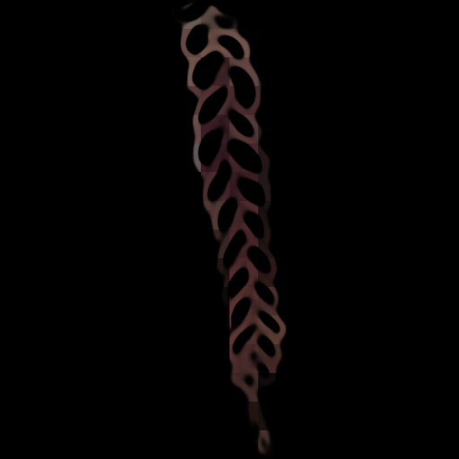 |  | 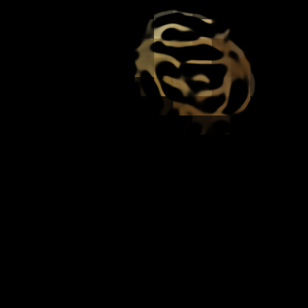 | 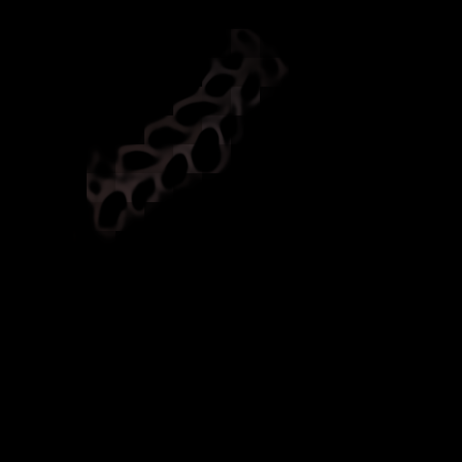 | 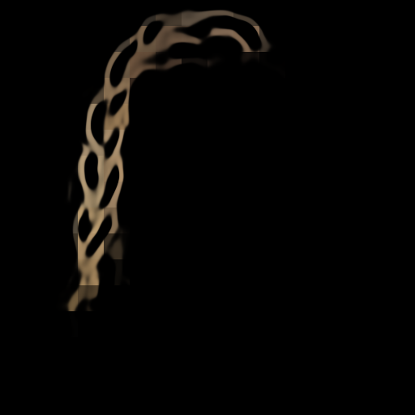 |

---

## Stage 2 — Round-trip 평가 패널

> hair → sketch_pred → HairControlNet (Stage 1) → hair_recon  
> 패널 순서: `[hair_orig | sketch_pred | matte_gt | hair_recon]`  
> LPIPS 0.073 / SSIM 0.893 / PSNR 20.9 dB (n=30)

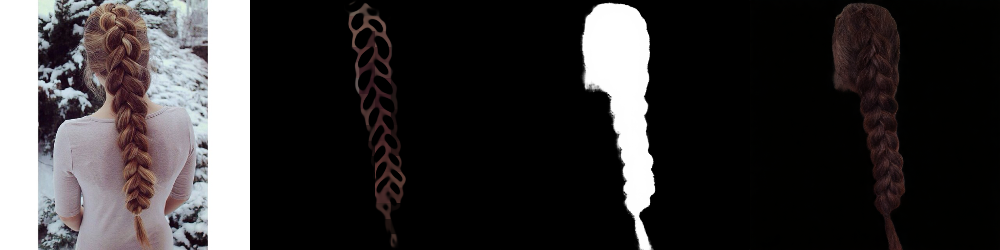
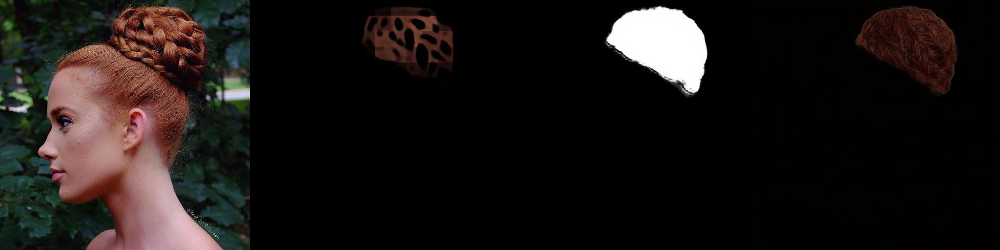
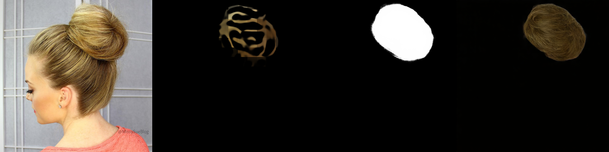
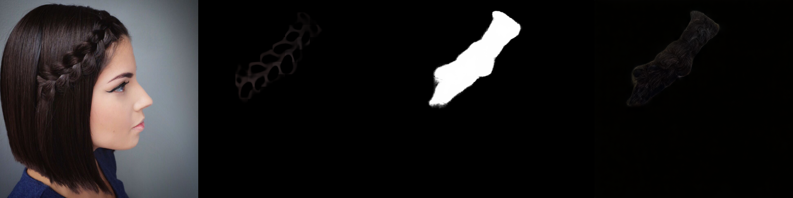
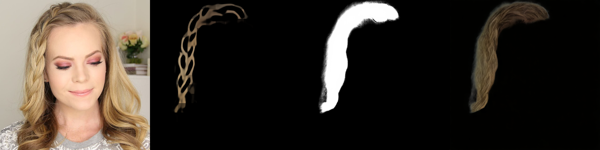

---

## Stage 3 Epoch 40 — Inverse 추론 결과 (cycle 활성 전)

> `checkpoints/inverse_stage3/last.pth` (epoch 40)  
> back_blocks가 FM gradient를 받기 시작한 상태; cycle loss는 아직 비활성

| | | | | |
|---|---|---|---|---|
| 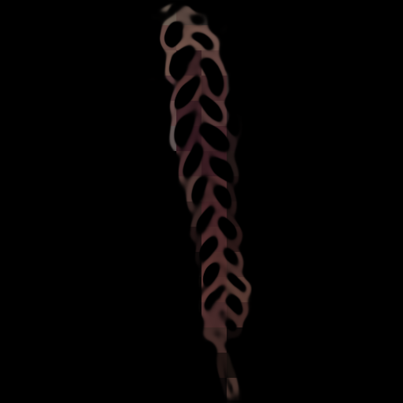 | 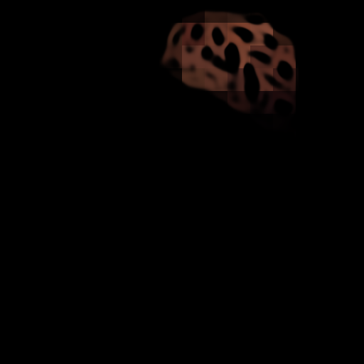 | 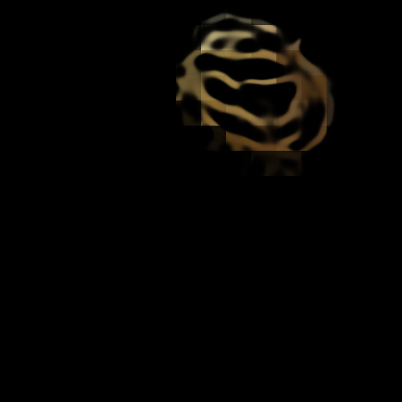 | 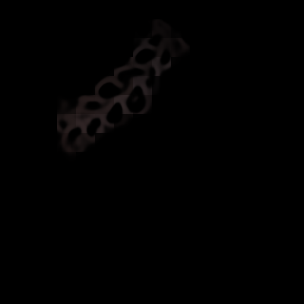 | 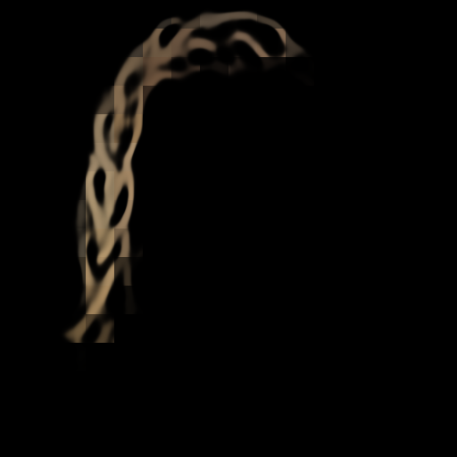 |

---

## Stage 3 Epoch 40 — Round-trip 평가 패널

> 패널 순서: `[hair_orig | sketch_pred | matte_gt | hair_recon]`  
> LPIPS 0.082 / SSIM 0.880 / PSNR 19.9 dB (n=50)

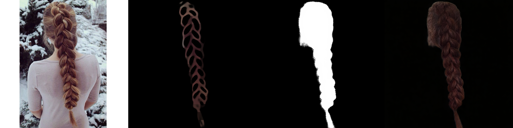
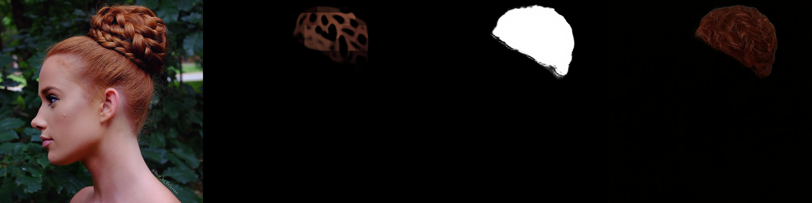
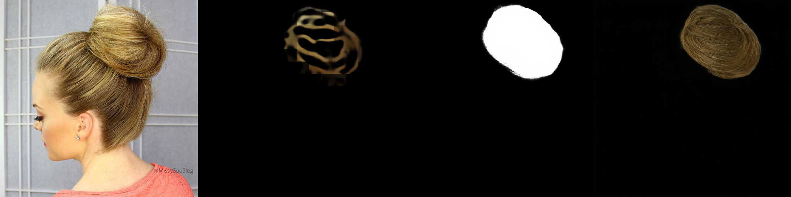
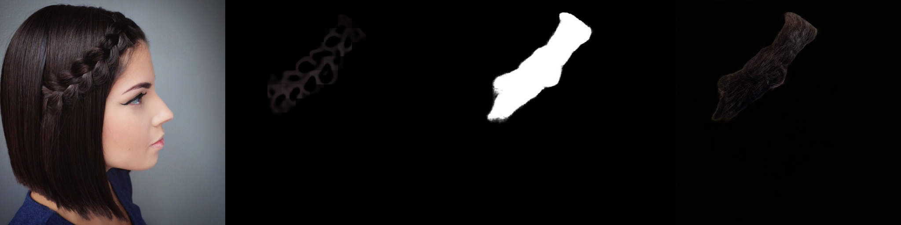
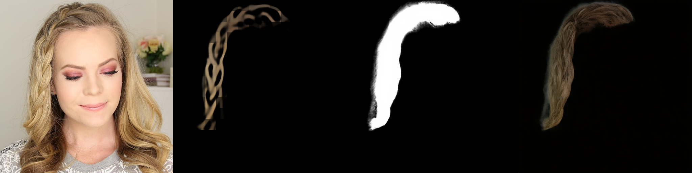

---

## 비교 요약

### Sketch 비교 (GT vs Stage2 vs Stage3, n=20)

> 열 순서: GT Sketch | Stage2 Sketch | Stage3 Sketch

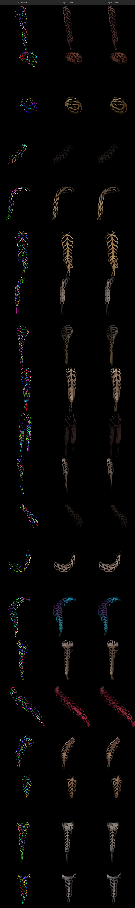

---

### Forward 비교 (GT vs DiT before vs Stage2 vs Stage3 Roundtrip, n=16)

> 열 순서: GT | DiT(before) | Stage2 Roundtrip | Stage3 Roundtrip

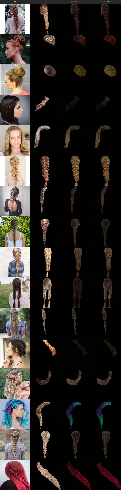

---

## 다음 계획

H100 이전 후 **epoch 41부터 cycle loss (feature MSE, `w_cycle=0.01`) 포함** 최종 학습 재개 예정.  
inverse ↔ forward 양방향 피드백이 본격 활성화되어 round-trip 지표 개선 기대.  
완료 후 동일 기준 (braid_test, n=50)으로 재측정.
