# 방법정리

1. `hair_latent` = ControlNet sampling (고정, 변형 없음)

2. **[Latent space]**
   ```
   face_latent = VAE.encode(face)
   matte를 64×64으로 다운샘플
   composite = torch.where(matte > 0.5, hair_latent, face_latent)
       → 헤어 영역: hair_latent 그대로
       → 배경 영역: face_latent
   ```

3. `full_image` = VAE.decode(composite)

4. **[Pixel space 후처리]**
   ```
   hard_mask = matte > 0.5
   full_clean = full_image * hard_mask + face * (~hard_mask)
       → 경계 거뭇거뭇을 원본 face로 덮어씌움
   ```

`hair_latent`는 건드리지 않고, face와의 합성은 latent space에서 하고, 경계 artifact만 pixel space에서 정리하는 구조.

---

## 전후 비교 (2534 ~ 2676)

| Before | After(V1) | After(v2) |
|:------------------:|:---------------:|:----------------:|
|  |  |  |
| 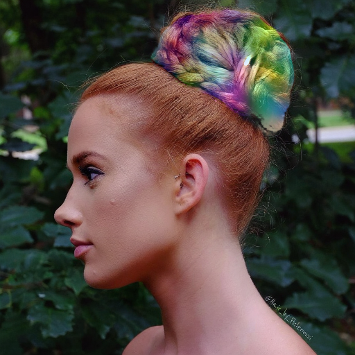 | 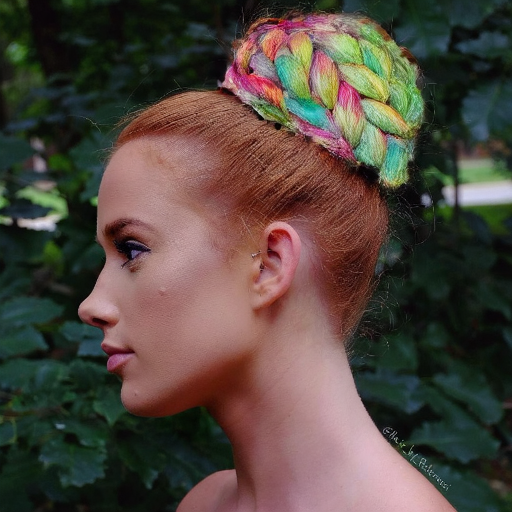 |  |
|  |  |  |
| 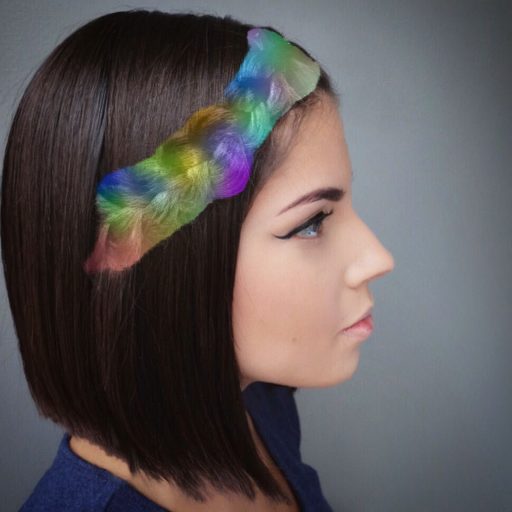 | 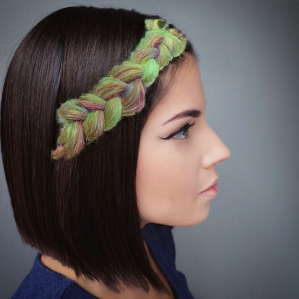 |  |
|  |  |  |
| 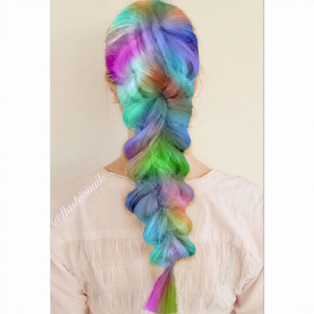 | 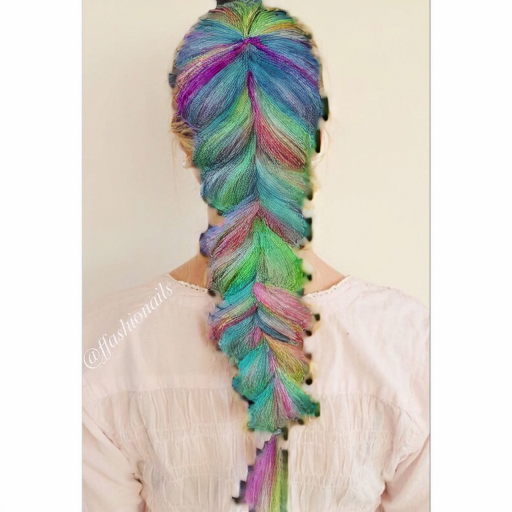 | 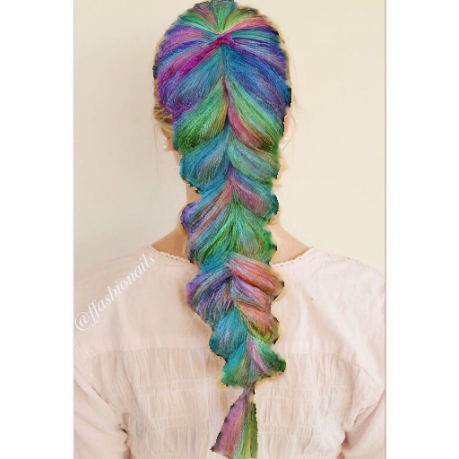 |
|  |  |  |
|  |  |  |
| 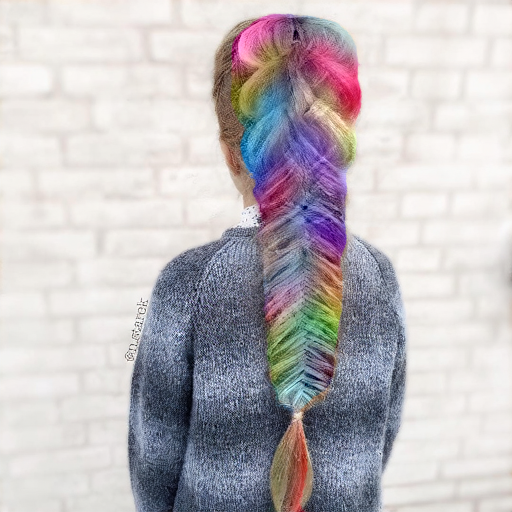 | 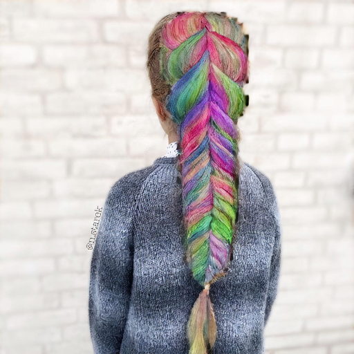 | 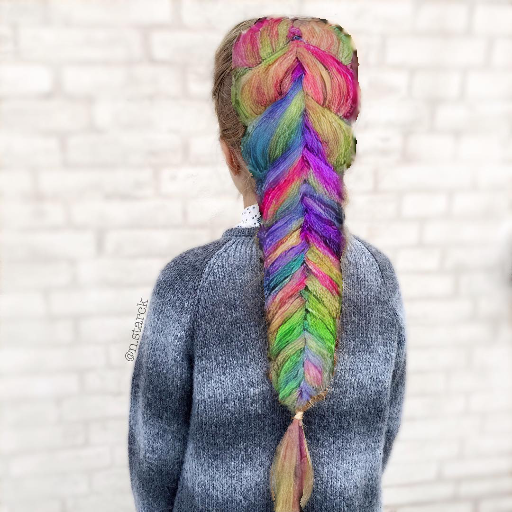 |
| 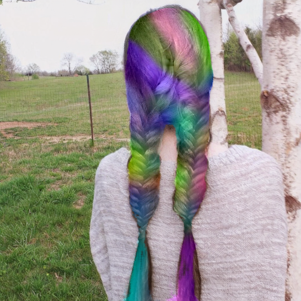 |  |  |
|  |  |  |
| 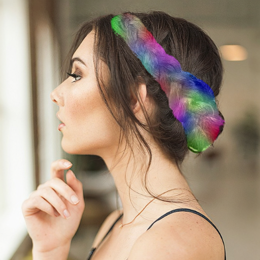 |  |  |
| 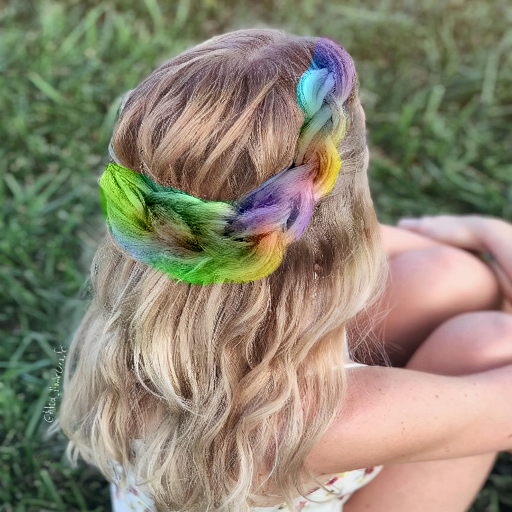 | 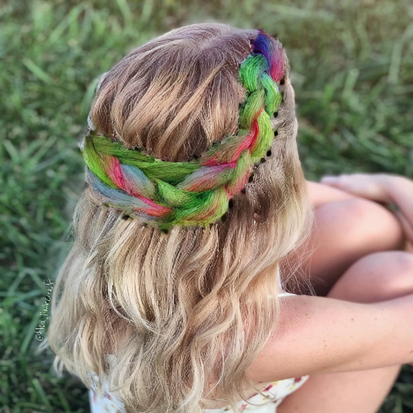 | 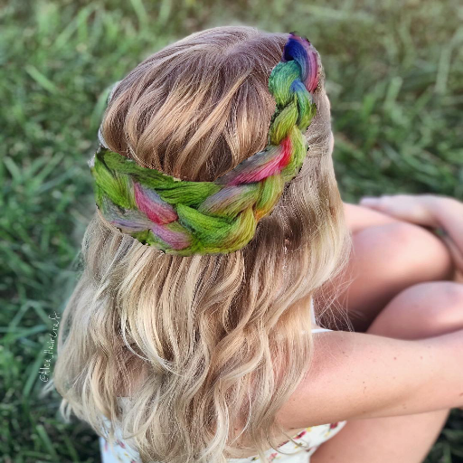 |
|  |  |  |
|  |  |  |
| 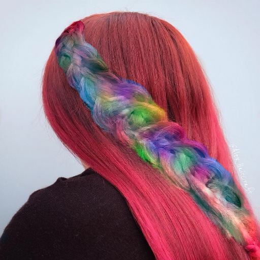 | 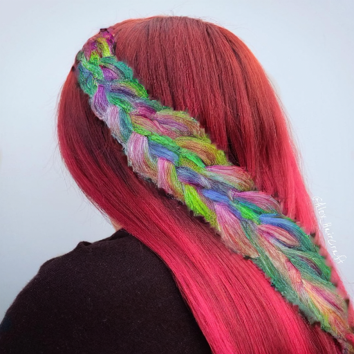 | 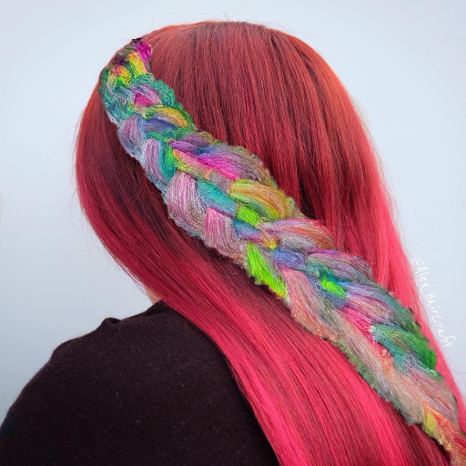 |


# 정량평가

## Overall Summary (n=107, hair region masked)

| Metric | GAN (SHS) | DiT (full) |
|--------|:---------:|:----------:|
| **Edge IoU ↑** | 0.1031 | **0.1047** |
| **Chamfer Dist ↓** | 2.6926 | **2.6739** |
| **Sketch LPIPS ↓** | **0.7590** | 0.7776 |
| **Hair FID ↓** | 195.06 | **177.63** |
| **LPIPS (GT) ↓** | 0.3263 | **0.3250** |
| **SSIM (GT) ↑** | 0.5906 | **0.5936** |
| **PSNR (GT) ↑** | 11.18 | **12.16** |
| **Boundary FID ↓** | 50.95 | **37.16** |
| **Boundary LPIPS ↓** | 0.0272 | **0.0267** |
| **Face LPIPS ↓** | 0.0036 | **0.0000** |
| **ArcFace Cos ↑** | 0.7697 | **0.7916** |

> FID: 107장 기준 (500장 이하, 참고용). ArcFace Cos: ResNet50 (ImageNet) embedding proxy.

## 지표 설명

### 스케치 충실도
- **Edge IoU ↑** — 생성 이미지의 엣지맵과 입력 스케치의 교집합/합집합 비율. 스케치 선을 얼마나 잘 따랐는지 측정. 헤어 영역 마스크 내에서만 계산.
- **Chamfer Dist ↓** — 생성 엣지맵과 스케치 엣지 간 최근접 거리의 평균. 선이 위치적으로 얼마나 가까운지 측정. 값이 작을수록 스케치와 일치.
- **Sketch LPIPS ↓** — 생성 이미지와 입력 스케치 간 perceptual 거리. 스케치의 질감·구조를 시각적으로 얼마나 반영했는지 측정.

### GT 재구성 품질
- **LPIPS (GT) ↓** — 생성 이미지와 GT 간 perceptual 거리 (VGG feature 기반). 낮을수록 GT와 시각적으로 유사.
- **SSIM (GT) ↑** — 생성 이미지와 GT 간 구조적 유사도 (밝기·대비·구조). 1에 가까울수록 GT와 일치.
- **PSNR (GT) ↑** — 생성 이미지와 GT 간 pixel-level MSE를 dB로 변환. 높을수록 픽셀 단위 오차가 작음.

### 분포 품질
- **Hair FID ↓** — 헤어 영역 크롭 이미지의 분포와 GT 분포 간 Fréchet 거리. 낮을수록 생성된 헤어가 GT 데이터셋 분포에 가까움. (107장 기준으로 참고용)
- **Boundary FID ↓** — 헤어-피부 경계 영역 크롭의 분포 거리. 낮을수록 경계 합성이 자연스러운 분포에 가까움.
- **Boundary LPIPS ↓** — 경계 영역에서 생성 이미지와 GT 간 perceptual 거리. 경계 artifact를 직접 측정.

### 얼굴 보존
- **Face LPIPS ↓** — 헤어 영역 외 얼굴 영역에서 생성 이미지와 GT 간 perceptual 거리. 0에 가까울수록 얼굴을 원본 그대로 보존.
- **ArcFace Cos ↑** — 생성 이미지와 GT의 얼굴 임베딩 코사인 유사도. 1에 가까울수록 동일 인물로 인식됨. (ResNet50 ImageNet proxy 사용)

---

## Per-Image Visual Comparison

각 행: GT 원본 | Sketch 입력 | GAN (SHS) 결과 | DiT (full) 결과  
각 행 아래: PSNR / SSIM / LPIPS (hair region 내, GAN vs DiT)

---

### braid_2534
| GT | Sketch | GAN (SHS) | DiT (full) |
|:--:|:------:|:---------:|:----------:|
|  |  |  |  |

| | GAN | DiT |
|--|:---:|:---:|
| PSNR ↑ | 10.10 | **10.64** |
| SSIM ↑ | 0.560 | **0.562** |
| LPIPS ↓ | 0.357 | **0.343** |

---

### braid_2537
| GT | Sketch | GAN (SHS) | DiT (full) |
|:--:|:------:|:---------:|:----------:|
| 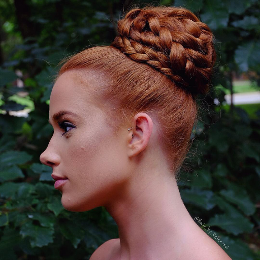 |  | 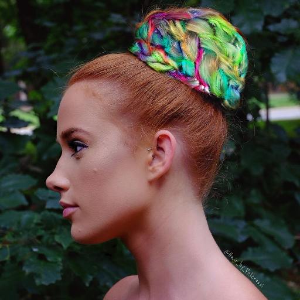 |  |

| | GAN | DiT |
|--|:---:|:---:|
| PSNR ↑ | **8.87** | 7.92 |
| SSIM ↑ | **0.427** | 0.405 |
| LPIPS ↓ | **0.453** | 0.457 |

---

### braid_2539
| GT | Sketch | GAN (SHS) | DiT (full) |
|:--:|:------:|:---------:|:----------:|
|  |  |  |  |

| | GAN | DiT |
|--|:---:|:---:|
| PSNR ↑ | 10.03 | **10.42** |
| SSIM ↑ | **0.370** | 0.362 |
| LPIPS ↓ | 0.414 | **0.397** |

---

### braid_2548
| GT | Sketch | GAN (SHS) | DiT (full) |
|:--:|:------:|:---------:|:----------:|
|  |  |  |  |

| | GAN | DiT |
|--|:---:|:---:|
| PSNR ↑ | **7.99** | 7.93 |
| SSIM ↑ | 0.675 | **0.680** |
| LPIPS ↓ | 0.285 | **0.285** |

---

### braid_2562
| GT | Sketch | GAN (SHS) | DiT (full) |
|:--:|:------:|:---------:|:----------:|
|  |  |  |  |

| | GAN | DiT |
|--|:---:|:---:|
| PSNR ↑ | **12.65** | 12.64 |
| SSIM ↑ | **0.774** | 0.764 |
| LPIPS ↓ | 0.190 | **0.177** |

---

### braid_2572
| GT | Sketch | GAN (SHS) | DiT (full) |
|:--:|:------:|:---------:|:----------:|
|  |  |  |  |

| | GAN | DiT |
|--|:---:|:---:|
| PSNR ↑ | 10.03 | **10.84** |
| SSIM ↑ | **0.500** | 0.487 |
| LPIPS ↓ | 0.415 | **0.413** |

---

### braid_2574
| GT | Sketch | GAN (SHS) | DiT (full) |
|:--:|:------:|:---------:|:----------:|
|  | 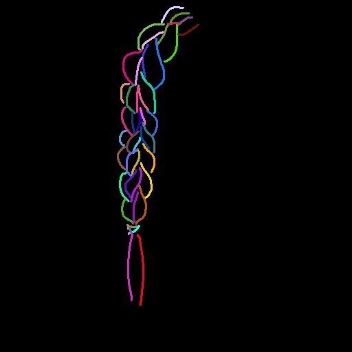 | 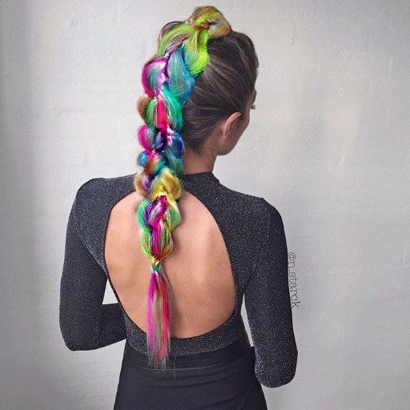 |  |

| | GAN | DiT |
|--|:---:|:---:|
| PSNR ↑ | 11.46 | **12.11** |
| SSIM ↑ | **0.722** | 0.717 |
| LPIPS ↓ | **0.302** | 0.318 |

---

### braid_2576
| GT | Sketch | GAN (SHS) | DiT (full) |
|:--:|:------:|:---------:|:----------:|
|  | 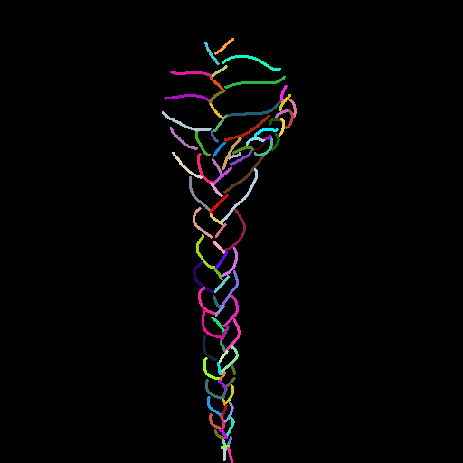 |  |  |

| | GAN | DiT |
|--|:---:|:---:|
| PSNR ↑ | **10.99** | 10.05 |
| SSIM ↑ | 0.615 | **0.633** |
| LPIPS ↓ | 0.361 | **0.317** |

---

### braid_2590
| GT | Sketch | GAN (SHS) | DiT (full) |
|:--:|:------:|:---------:|:----------:|
|  | 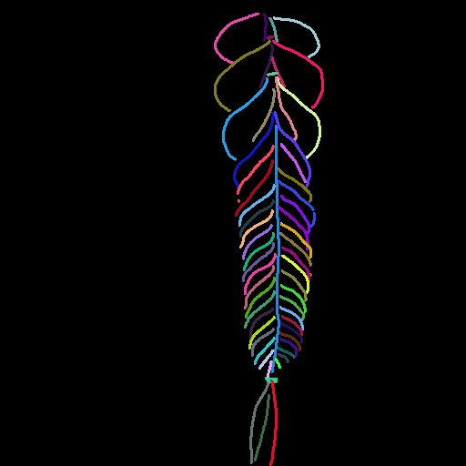 |  |  |

| | GAN | DiT |
|--|:---:|:---:|
| PSNR ↑ | 11.07 | **12.40** |
| SSIM ↑ | **0.475** | 0.474 |
| LPIPS ↓ | **0.416** | 0.446 |

---

### braid_2592
| GT | Sketch | GAN (SHS) | DiT (full) |
|:--:|:------:|:---------:|:----------:|
|  |  |  |  |

| | GAN | DiT |
|--|:---:|:---:|
| PSNR ↑ | **9.77** | 9.62 |
| SSIM ↑ | 0.436 | **0.451** |
| LPIPS ↓ | **0.450** | 0.476 |

---

### braid_2617
| GT | Sketch | GAN (SHS) | DiT (full) |
|:--:|:------:|:---------:|:----------:|
|  |  |  |  |

| | GAN | DiT |
|--|:---:|:---:|
| PSNR ↑ | 12.73 | **13.73** |
| SSIM ↑ | 0.664 | **0.675** |
| LPIPS ↓ | 0.279 | **0.263** |

---

### braid_2625
| GT | Sketch | GAN (SHS) | DiT (full) |
|:--:|:------:|:---------:|:----------:|
|  |  |  |  |

| | GAN | DiT |
|--|:---:|:---:|
| PSNR ↑ | 7.61 | **9.80** |
| SSIM ↑ | 0.697 | **0.711** |
| LPIPS ↓ | 0.298 | **0.281** |

---

### braid_2652
| GT | Sketch | GAN (SHS) | DiT (full) |
|:--:|:------:|:---------:|:----------:|
|  | 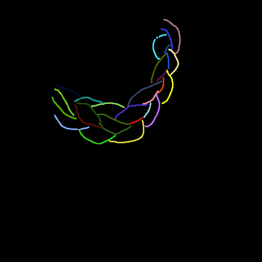 | 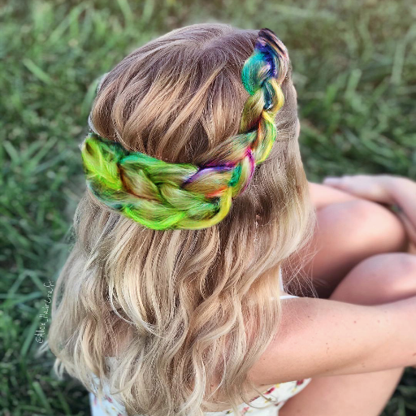 |  |

| | GAN | DiT |
|--|:---:|:---:|
| PSNR ↑ | **10.97** | 10.83 |
| SSIM ↑ | 0.682 | **0.682** |
| LPIPS ↓ | 0.233 | **0.230** |

---

### braid_2653
| GT | Sketch | GAN (SHS) | DiT (full) |
|:--:|:------:|:---------:|:----------:|
|  |  |  |  |

| | GAN | DiT |
|--|:---:|:---:|
| PSNR ↑ | 9.83 | **10.23** |
| SSIM ↑ | **0.756** | 0.753 |
| LPIPS ↓ | **0.197** | 0.216 |

---

### braid_2657
| GT | Sketch | GAN (SHS) | DiT (full) |
|:--:|:------:|:---------:|:----------:|
|  | 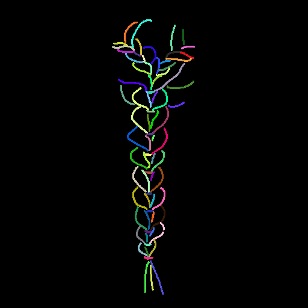 |  |  |

| | GAN | DiT |
|--|:---:|:---:|
| PSNR ↑ | 11.31 | **12.68** |
| SSIM ↑ | **0.579** | 0.579 |
| LPIPS ↓ | 0.316 | **0.311** |

---

### braid_2676
| GT | Sketch | GAN (SHS) | DiT (full) |
|:--:|:------:|:---------:|:----------:|
|  | 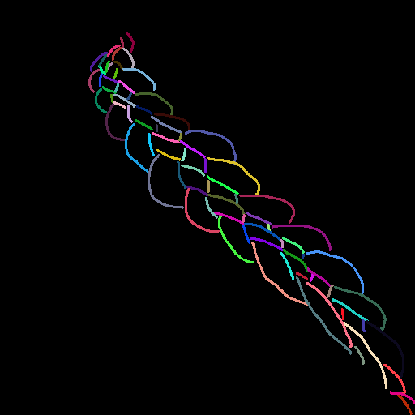 | 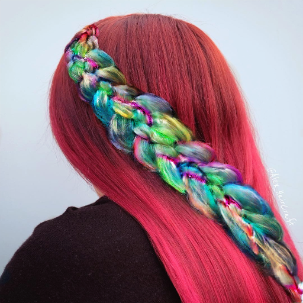 |  |

| | GAN | DiT |
|--|:---:|:---:|
| PSNR ↑ | 9.17 | **9.46** |
| SSIM ↑ | **0.775** | 0.771 |
| LPIPS ↓ | 0.192 | **0.192** |

## Sketch / GT / HairClipV2 / SHS / DiT 비교 

| Sketch | GT | HairClipV2 | SHS | DiT |
|:------:|:--:|:----------:|:---:|:---:|
|  |  | 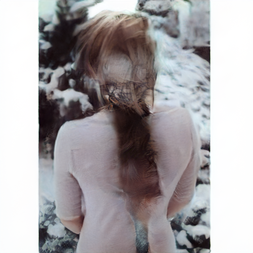 |  |  |
|  |  | 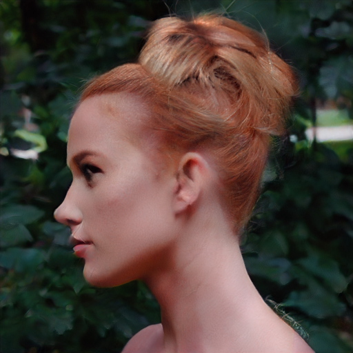 |  |  |
|  |  | 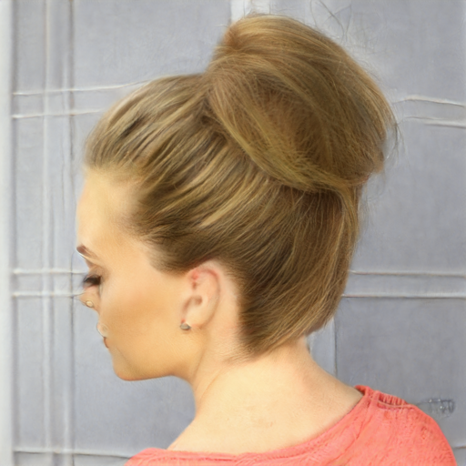 |  |  |
|  |  | 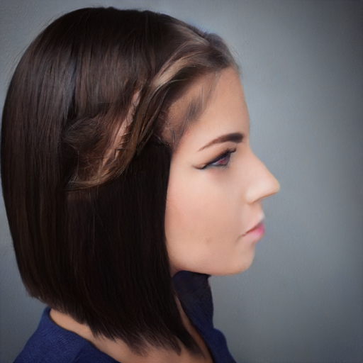 |  |  |
|  |  | 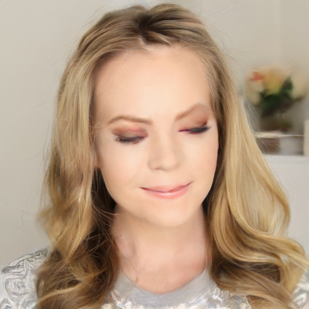 |  |  |
|  |  | 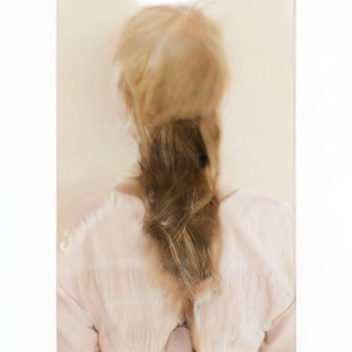 |  |  |
|  |  | 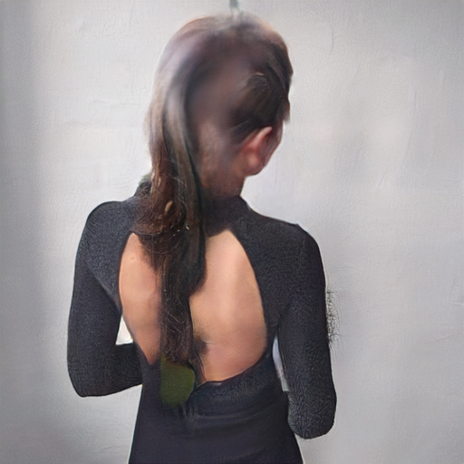 |  |  |
|  |  | 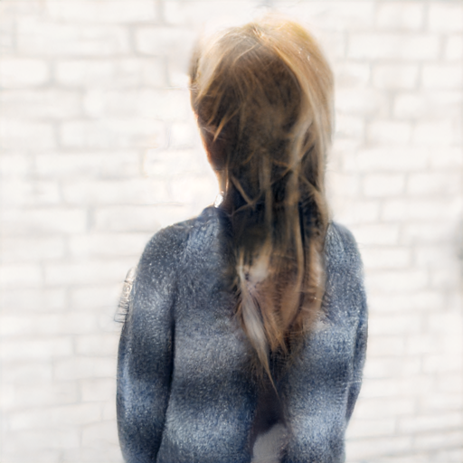 |  |  |
|  |  | 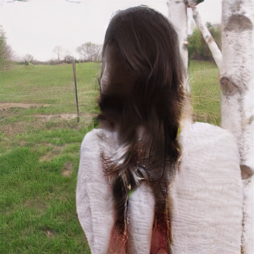 |  |  |
|  |  | 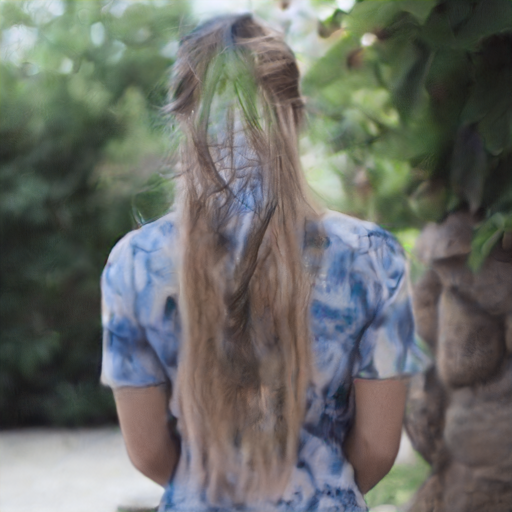 |  |  |
|  |  |  |  |  |
|  |  |  |  |  |
