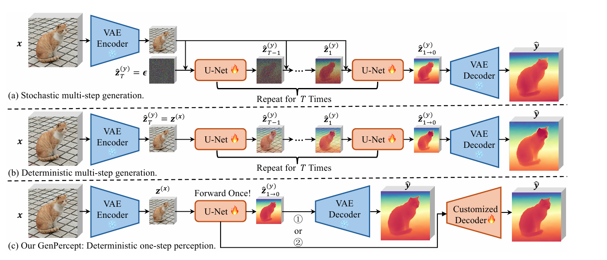
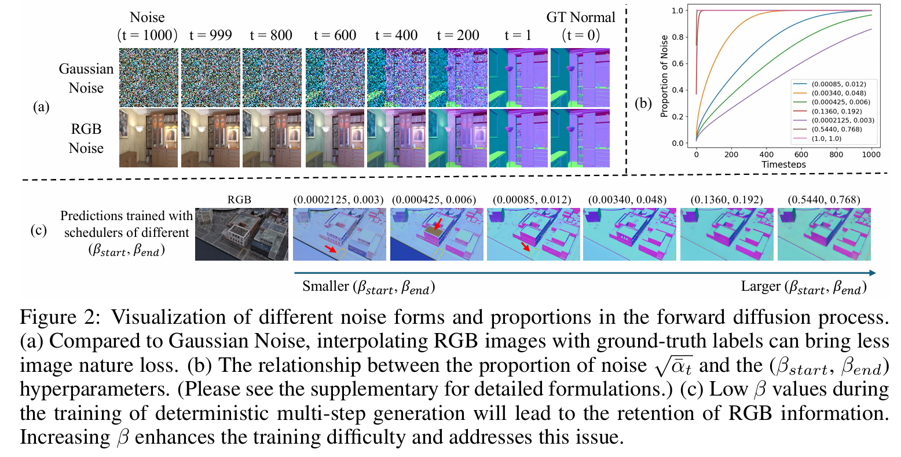

## Abstract

최근 대규모 T2I 사전 학습의 발전으로 T2I 확산모델을 미세조정하여 dense perception 작업에서 결과를 얻는 연구들이 등장하고 있음

하지만, 이 과정에서 multistep 확률적 확산 메커니즘의 필요성, 학습 전략, 추론 앙상블 전략, fine-tune 등 중요한 설계 결정들에 대한 근거가 부족

본 논문은 diffusion 모델의 사전 지식을 사용할 때 전이 효율성과 성능에 영향을 미치는 핵심 요소들과 발견 사항을 제시

1) 의미론적 및 기하학적 인식 작업 모두에서 고품질의 미세조정 데이터가 가장 중요하다
2) diffusion 모델의 stochastic 특성은 deterministic인 시각 인식 작업에 부정적인 영향을 끼친다
3) latent space의 supervision 만으로 diffusion 모델을 미세 조정하는 것 이외에도 작업에 특화된 이미지 수준의 감독이 세밀한 디테일을 향상시키는데 유익하다.

=> 결정론적 1단계 미세 조정 패러다임 GenPercept 제안
(예측의 디테일을 높이는 데 필수적인 맞춤형 인식 디코더 및 이미지 수준 감독을 위한 손실 함수와 매끄럽게 통합)

## Introduction
1. 배경 및 문제 제기

- 최근 diffusion 모델을 기하학 추정이나 이미지 분할, 역렌더링등과 같은 밀접 시각 인식 작업에 활용하여 뛰어난 결과를 보여주는 연구들이 등장.
- 하지만 가우시안 노이즈를 활용해 U-Net 전체를 학습시키는 방식이나 모델을 고정한 채 LoRA만을 학습시키는 방식 등 연구마다 설계가 달라 어떤 전략이 최적의 성능을 내는지에 대한 명확한 근거가 부족한 상황

2. 연구의 핵심 질문

- 일반적인 밀집 인식 작업을 위해 diffusion 모델을 조정할 때, 어떤 요소가 중요한가? 

3. 3가지 주요 발견 사항

- 확률론적 특성의 한계 : diffusion 모델 특유의 stochastic 성질은 정답이 명확한 deterministic 인식 작업과 다소 충돌하며, 학습 시 사용하는 노이즈의 비율이 성능에 큰 영향을 미친다.

- 1단계 추론의 효율성 : 기존 diffusion 모델처럼 여러 단계에 걸쳐 점진적으로 노이즈를 제거하는 방식을 따를 필요가 없다. 단일 단계 추론으로도 비슷한 성능을 내면서 실행속도는 빠르다

- 고품질 데이터의 필수성 : 기하학적인 인식 작업에서는 고품질의 데이터 합성 데이터로 모델을 미세 조정하는 것이 매우 중요하다

4. 제안 모델 : GenPercept

- 특징 : 번거로운 다단계 과정을 거치지 않는 단순한 1단계 추론 파이프라인을 갖추고 있으며, 필요에 따라 맞춤형 디코더 및 픽셀별 손실 함수를 적용할 수 있다

- 검증 : 단일 카메라 깊이 추청, 표면 법선 추정, 이미지 분할 및 매팅 등 다양한 시각 인식 작업에 적용하여 효율 입증

(a) 확률론적 다단계 생성 : 정답 라벨에 가우시안 노이즈를 추가한 뒤, 여러 단계(T번)에 걸쳐 점진적으로 노이즈를 제거하며 결과를 예측한다. 성능은 우수하지만, 계산량이 많고 결과가 확률적이라는 단점이 있다

(b) 결정론적 다단계 생성 : 무작위 가우시안 노이즈 대신 입력 RGB 이미지를 노이즈처럼 사용하여 정답 라벨과 혼합하는 방식이다. 무작위성은 피했지만 여전히 여러 단계를 거쳐야 한다.

(c) GenPercept(제안 방법) : 연구진이 고안한 결정론적 1단계 인식 패러다임. 여러 번 U-Net을 거칠 필요 없이 단 한번의 통과만으로 예측을 수행한다. 또한 무거운 기본 VAE 디코더를 대체할 수 있는 가벼운 맞춤형 디코더와 픽셀 단위 손실 함수를 적용하여 추론 속도를 비약적으로 높이고 에측의 세밀한 디테일을 향상시켰다.

#### Figure2(a) - 노이즈 형태의 차이

기존의 가우시안 노이즈를 사용하는 것보다, 결정론적 방식처럼 RGB 이미지를 정답 라벨과 섞어 쓸 때 학습 난이도가 훨씬 낮아진다. 가우시안 노이즈는 자연스러운 이미지와 거리가 멀어 학습을 지나치게 어렵게 만들기 때문이다.

#### Figure2(c) - 노이즈 비율 증가에 따른 잔상 해결

결정존적 방식에서 노이즈(RGB)가 섞이는 비율을 나타내는 스케줄러 값이 낮으면 학습 난이도가 너무 낮아져 앞서 말한 RGB 잔상 문제가 뚜렷하게 나타난다. 연구진은 이를 해결하기 위해 베타값을 점진적으로 높여 의도적으로 훈련 난이도를 증가시켰다. 베타값이 커질 수록 책장 등의 잔상이 사라지고 예측이 훨씬 깔끔해지는 것을 확인 할 수 있다.

#### Figure2(b) - 베타 값이 1에 도달했을 때 발견

노이즈 비율을 최대치인 1까지 올렸을 때 결과. 입력 라벨이 순수한 노이즈(이 경우 RGB 이미지 자체)로 완전히 대체되면서 중간 단계들에서 에측하는 결과값들이 모두 동일해진 것이다. 굳이 여러 번 (T번) 노이즈를 제거하는 다단계 과정을 거칠 필요 없이, 단 1번의 추론만으로도 다단계 방식과 동일한 성능을 낼 수 있다는 사실을 발견하였다.

요약하자면, 결정론적 확산모델이 가진 잔상 문제를 해결하기 위해 노이즈 비율을 극한으로 끌어올렸을 때, 중간의 복잡한 다단계 훈련 과정이 무의미해지면서 초고속 1단계 fine-tuning GenPercept 가 탄생하게 된것이다.

### The form and proportion of noise in the forward diffusion process

- 성능향상 : 노이즈 비율이 커질수록 훈련 난이도가 올라가면서 결정론적 모델의 성능이 꾸준히 향상되었다. 반면 가우시안 노이즈 방식은 노이즈가 과해지자 무작위성 때문에 오히려 성능이 약간 불안정해졌다.

- 단일 단계의 발견 : 노이즈 비율이 최대값인 1에 도달했을 때 입력 라벨은 100% 순수한 노이즈로 완전히 대체. 이렇게 되자 모델이 여러 단계에 걸쳐 점진적으로 노이즈를 제거하는 중간 과정들이 모두 똑같은 예측을 반복하는 무의미한 상태

- 단 한번의 U-Net 통과 만으로도 다단계 방식과 동일한 성능을 낼 수 있다는 놀라운 결론에 도달한 것이다.

### Where does the rich visual knowledge reside in diffusion models?

- 핵심 지식은 디노이즈(U-Net)에 있다. diffusion 모델이 가진 강력한 시각적 지식의 대부분이 디노이저 모듈에 저장되어 있음을 의미한다.

- VAE 디코더의 사전 지식은 덜 중요하다. 반면, 기본 디코더를 사전 학습된 파라미터 없이 처음부터 학습시켜도 모델은 여전히 우수한 성능을 유지하였다. 즉 고정된 형태의 기본 VAE 디코더를 억지로 고집할 필요가 없다는 뜻이다

- 1단계 추론 방식을 활용하면 무거운 기본 VAE 디코더를 버리고 맞춤형 인식 디코더로 쉽게 대체. 여기에 latent space가 아닌 픽셀 단위의 이미지 수준 손실 함수(pixel-wise loss)를 적용할 수 있게 되는데 이를 통해 모델의 추론 속도를 크게 단축시키면서도 세밀한 디테일을 잡아낼 수 있게 되었다.

### WHAT ABOUT THE TIMESTEPS AND TEXT PROMPTS?

- 시각 인식 작업에서는 이 두가지 요소가 성능에 거의 영향을 미치지 않는다

### How to leverage the U-Net's prior knowledge

- U-Net을 어떻게 학습시키는 것이 최적일까? 실험 진행
- UNet 동결 : U-Net의 가중치를 고정하고 중간 특징만 가져와 개별적인 디코더만 학습시킨 결과 성능이 크게 하락
- LoRA 활용 : 전체 미세 조정 대신에 효율적인 LoRA를 적용해보았으니 랭크를 4,16 에서 최대 1024까지 크게 늘려보아도 U-Net 전체를 학습시킨 모델의 성능은 온전히 따라잡지 못하였다
- U-Net 전체 미세 조정 : U-Net의 모든 파라미터를 미세 조정한 베이스라인이 가장 압도적인 성능을 보였다.

### Is the training data quality essential?

- 학습 데이터의 품질은 밀집 시각 인식 작업에서 세밀한 디테일을 예측하는 데 필수적이다.
- 합성 데이터 : 시뮬레이터를 통해 정밀하게 렌더링 되어 정답의 품질이 매우 높은 데이터
- 실제 데이터 : 실제 환경을 촬영한 데이터로 합성 데이터에 비해 상대적으로 정답 라벨의 품질이 낮고 노이즈가 섞여 있다.

